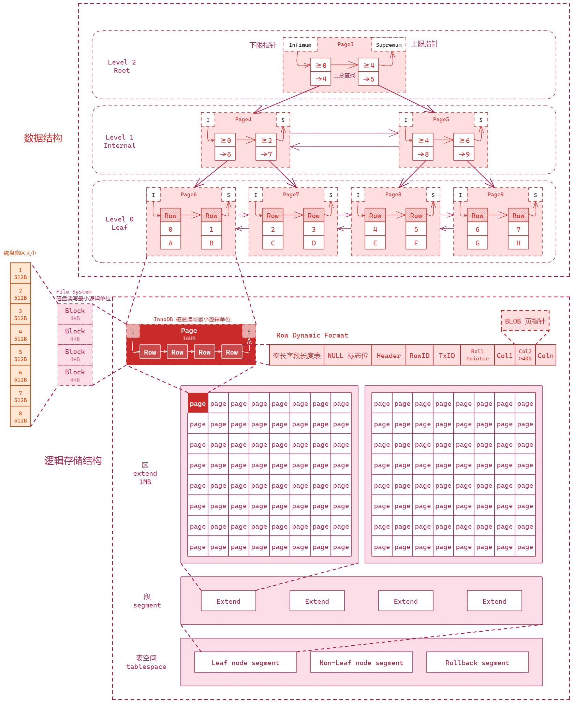
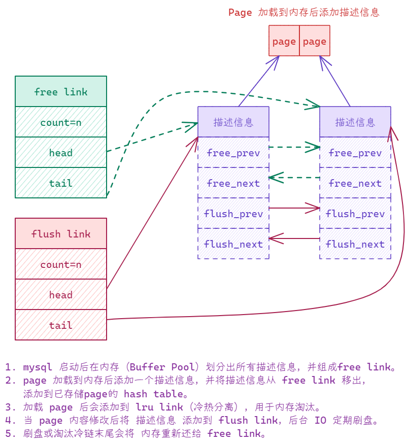
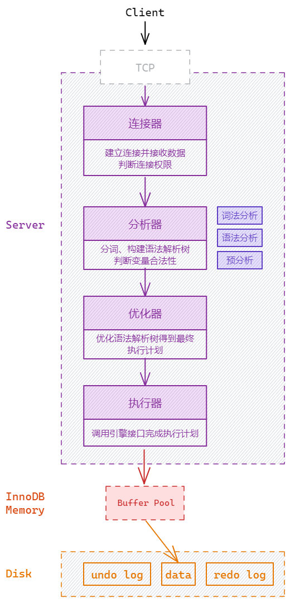
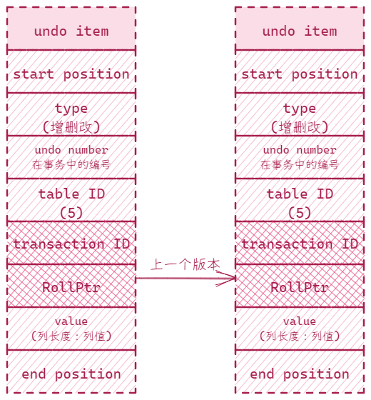
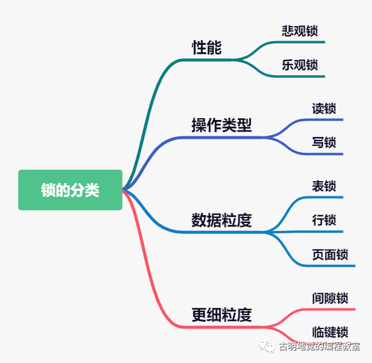
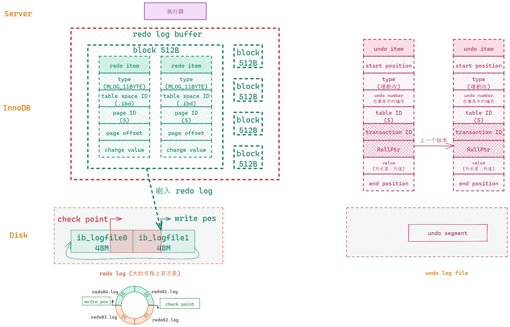
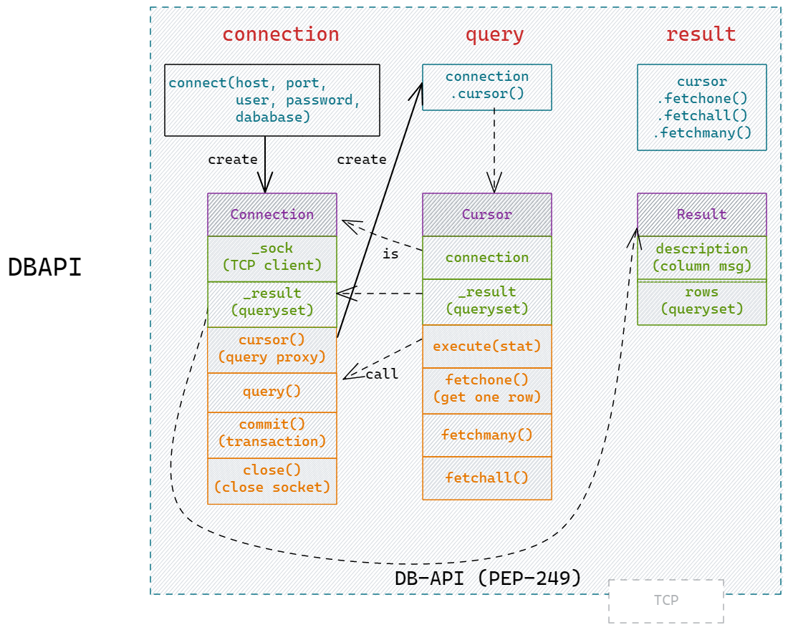

# MySQL 流程


## 本质逻辑 - 索引

线性查找（O(N)）、二分查找(O(logN))、二叉树(有序，还是O(logN)，可能会退化到线性)、平衡二叉树(解决退化问题)、B树（每个节点数量由1个变为多个，减少磁盘IO）、B+树（在叶子节点建立双向连接，优化范围查询）。

## 配置

```bash
[server]

innodb_buffer_pool_size = 8589934592  # 128M
innodb_buffer_pool_instances = 4

innodb_log_buffer_size = 16M  # redo buffer 大小
innodb_flush_log_at_trx_commit = 1  # commit 时刷入redo文件
innodb_log_file_size = 48M # redo 文件大小
innodb_log_files_in_group = 2  # redo 文件个数
```

## Data Model

InnoDB 引擎始终以 **Page** 为最小单位进行操作。Page 是一个操作的基本单位，将逻辑存储结构与内部数据结构完美结合，并通过不同组织形式（数据结构）完成操作管理：二叉树用来优化查找，双向链条用来维护内存，如free、flush和lru三个链条，相辅相成共同维护内存管理。理解 Data Model 有助于我们建表和索引优化。



数据在内存中的管理



## 建表及索引优化方向

where order_by group_by

- 使用索引：

  - 二叉树：层级不能太高、每个层级不能太多

  - page页：row 不能太少
  - 最左原则：联合索引、字符串前缀索引

- 减少IO：
  - 网络IO
  - 磁盘IO

可能的方案：

- 冷热数据分离，减小表的宽度（减小 Row）
- 最小数据类型（Row）
- Blob或 Text 单独放到扩展表（避免行溢出，Row）
- 图片存放 url（Row）
- 单表数据量控制在500万以内（B+树高度）

## 数据更新过程

InnoDB 的整体数据流动过程



数据更新和插入涉及到数据安全，MySQL 的一项重要特性就是保证数据安全，而能够保证安全是由InnoDB 的**日志文件**实现的。

InnoDB 中使用事务来实现数据安全，可以用 ACID 概括。即：原子性、一致性、隔离性、持久性。

- redo log（InnoDB 产生的物理日志-记录page变化，持久性）
- undo log（InnoDB 产生的逻辑日志-记录反向行变化，原子性、隔离性）
- binlog（server（执行器）产生的逻辑日志-行变化，可用于主从复制）

### 原子性

要么都成功要么都失败，使用 **undo log** 形式实现。在row 中有两个隐藏字段 trx_id 和 roll_ptr



### 一致性

内存和硬盘数据一致。两阶段提交法实现：即**redolog**刷盘后**binlog**刷盘，最后将binlog成功消息再刷入redolog才算完成事务。另外还要保证数据符合逻辑。

### 隔离性 isolation

事务之间不能相互影响，通过 **锁**和 **MVCC**（Multi-Version Concurrency Control） 实现。其中 **MVCC 则是由 undo log 多版本链 和 ReadView** 实现。 多事务间要解决以下问题：

- 脏读：读到了另一个事务未提交的数据
- 不可重复读：同一个事务两次读取数据不一致，数据值改变了。
- 幻读：也是两次读取数据不一致，不过这个是insert造成，就是数量多了。

| 要解决的问题➡                  |                  脏写                  |                             脏读                             |                         不可重复度                          |                     幻读                     |
| ------------------------------ | :------------------------------------: | :----------------------------------------------------------: | :---------------------------------------------------------: | :------------------------------------------: |
| **目前隔离级别⬇**              |       （两个事务同时写造成覆盖）       |               *（读到另一个事务未提交的数据）*               |              *（当前事务两次读取数据不一致）*               | *（当前事务两次读取数据数量不一致 insert）*  |
| 读未提交<br />read uncommitted | :white_check_mark:<br />使用**锁**解决 |                             :x:                              |                             :x:                             |                     :x:                      |
| 读已提交<br /> read committed  |           :white_check_mark:           | :white_check_mark:<br />使用 **MVCC** 实现，每个事务一个 ReadView |                             :x:                             |                     :x:                      |
| 可重复读<br />repeatable read  |           :white_check_mark:           |                      :white_check_mark:                      | :white_check_mark:<br />同样 **MVCC** 但ReadView 使用同一个 | :exclamation:<br />InnoDB 使用**间隙锁**解决 |
| 串行化<br />serializable       |           :white_check_mark:           |                      :white_check_mark:                      |                     :white_check_mark:                      | :white_check_mark:<br />**不能同时**两个事务 |

**如何解决？**

同时写的问题通过锁解决，读写问题使用 MVCC （undo log 多版本链和 ReadView 机制）解决。

undo log 版本链就是每次修改 row 都会创建一个新的 undo log 并指向之前的 undo log，最后根据 undo log 的事务id 和当前事务的 readview生成的事务id进行判断对比，如果符合则返回数据，不符合则沿着 undo log 链继续查找，这里涉及的数据结构（undo log 链）是简单的解释，更深入的结构请看 [MySQL · 引擎特性 · 庖丁解InnoDB之UNDO LOG](http://mysql.taobao.org/monthly/2021/10/01/)

锁：



### 持久性

保证事务完成后数据永不丢失。通过redolog实现。

redo log 也是文件但其写入是顺序IO，一次插入文件尾部，且相对于 page 来说要小得多，所以是先写 redo log 写入了就表示持久了。

格式：在 table space XX 的第 YY 个数据页中偏移量为 ZZ 的位置更新了数据DD。



## ORM

SQLAlchemy 源码分析


DBAPI



[如何使用](../python/model.md)

## 参考

- https://www.cnblogs.com/traditional/tag/%E5%85%B3%E7%B3%BB%E5%9E%8B%E6%95%B0%E6%8D%AE%E5%BA%93/
- [MySQL · 引擎特性 · 庖丁解InnoDB之UNDO LOG](http://mysql.taobao.org/monthly/2021/10/01/)
- [高并发 高性能 高可用 MySQL 实战](https://coding.imooc.com/class/515.html)
