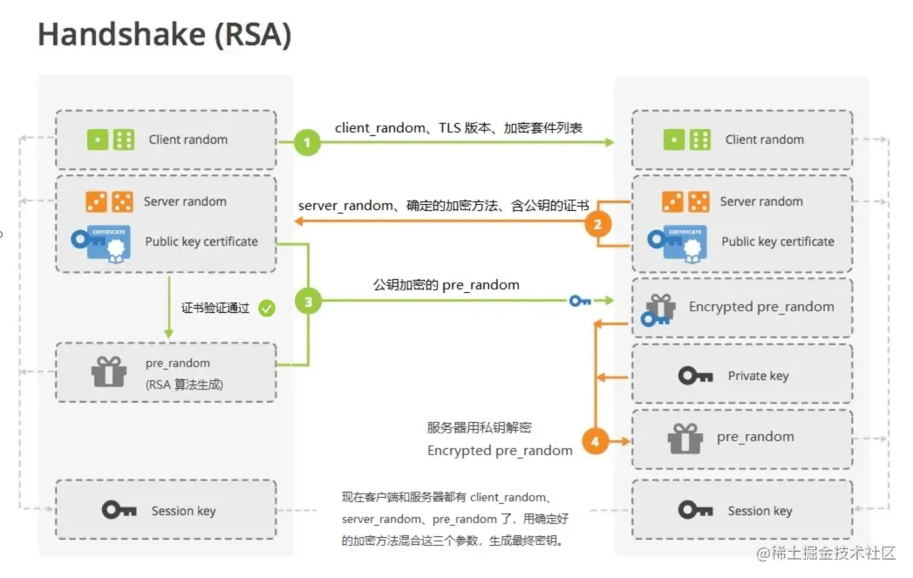
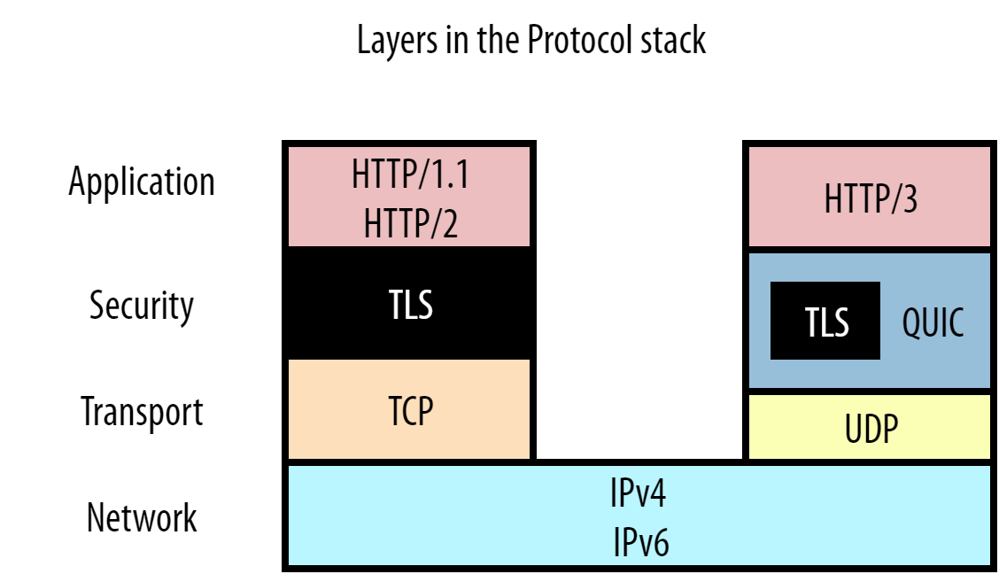

HTTP 超文本传输协议。

优点：简单易扩展、无状态（方便集群但不支持事务）。

缺点：明文（文本）、不安全、性能有待提高（队头阻塞）。

> 各个节点（应用）之间为了交流，形成了一个无形的网，称为Internet（因特网），Internet 中又由无数个小的网络组成。WEB（www，万维网）是Internet 的子集，是指专门使用 HTTP 协议进行通信的网络。当今世界大多数都是 HTTP 协议，但还有其他如 SMTP、FTP等。

## HTTP历史

- 1991年0.9 基本雏形，只有GET，没有多媒体。

- 1996年1.0 多方法，支持多媒体。

- 1997年1.1 长连接（keep-alive，保持TCP连接复用通道，减少握手挥手）、客户端缓存、断点续传，队头阻塞（响应要按序返回，当前面堵塞后面的就要等待）

- 2015年2.0 二进制协议，多路复用，压缩头部、服务端推送。
- 3.0 基于 UDP 并吸纳 TCP 的可靠性创建的新协议QUIC（属于应用层）在此基础上创建3.0。

## HTTP 报文

### 报文结构

请求：

```
请求方法 请求路径 HTTP版本

请求头

[请求体]
```

响应

```
HTTP版本 状态码 状态解释

响应头

响应体
```

### HTTP Headers

govern request、response parameters。

| 参数           | 所属    | 说明                      | 取值                                                         |
| -------------- | ------- | ------------------------- | ------------------------------------------------------------ |
| Accept         | Request | 可接受内容类型            | type/sub-type，\*/\* 任意类型                                |
| Authentication | Request | 身份凭证                  | Bearer ABC                                                   |
| Cache-Control  | Request | 对服务器的缓存控制        | no-cache 不缓存                                              |
| Content-Type   |         | 服务器返回的内容类型      | 'Application/json; charset=utf-8' [更多](http://www.iana.org/assignments/media-types/media-types.xhtml) |
| Host           | Request | 服务器域名                | IP:port                                                      |
| Referer        | Reuest  | 从那个 URL 获得的当前 URL | 百度                                                         |
| User-Agent     | Request | 客户端信息                |                                                              |

> https://developer.mozilla.org/en-US/docs/Web/HTTP/Headers

### HTTP Methods

执行的动作。

| method | 说明         |      |
| ------ | ------------ | ---- |
| POST   | 创建一个资源 |      |
| GET    | 获得资源     |      |
| PUT    | 修改一个资源 |      |
| DELETE | 删除一个资源 |      |

幂等：无论进行多少次操作都会得到相同结果。幂等的方法客户端可以安全的重复请求。POST是非幂等的。

安全：指是否修改数据。

### 状态码 Status code

| code | message                   | description                            |
| ---- | ------------------------- | -------------------------------------- |
| 200  | OK                        | 请求成功                               |
| 201  | Created                   | 创建成功                               |
| 202  | Accepted                  | 更新成功                               |
| 204  | No Content                | 删除成功                               |
| 206  | Partial Content           | 返回部分资源（分块下载）               |
| 301  | Moved Permanently         | 永久重定向                             |
| 302  |                           | 临时重定向                             |
| 304  | Not Modified              | 缓存重定向（不会跳转）                 |
| 400  | Bad Request               | 请求有误                               |
| 401  | Unauthorized              | 未登录                                 |
| 403  | Forbidden                 | 无权限                                 |
| 404  | Not Fount                 | 请求资源不存在                         |
| 405  | Method Not Allowed        | HTTP 方法不允许                        |
| 413  | REQUIRED LENGTH TOO LARGE | 上传的File体积太大                     |
| 500  | Internal Server Error     | 服务器内部错误                         |
| 501  | Not Implement             | 功能还未实现（即将开业）               |
| 502  | Bad Gateway               | 网关错误（代理服务器获取了无效的响应） |
| 503  | Server Uniavailable       | 服务器维护中                           |
| 504  | Gateway Timeout           | 网关超时（代理服务器获取后台服务超时） |

### 查询参数 Query Parameters

在 url 中通过 ?key=value 的形式传递

### HTTP 实体

HTTP 报文分为 header + body，body就是我们需要处理的数据。HTTP的重点也是报文结构，body内容可以通过猜的方式确定内容，但效率会低，所以会在 header 中定义字段来确定 body 格式，方便处理。

- 内容类型 MIME TYPE，使用 Accept（接收）、Content-Type（实际）字段，值 text/html, application/json
- 内容压缩 字段：Accept-Encoding、Content-Encoding，值：gzip, br
- 内容编码（国际化）字段：Accept-Language、Content-Language（省略，直接字符集推断），值：zh-CN,en
- 字符集 字段：Accept-Charset（省略）、Content-Type（没有对应的 Content-Charset），值：utf-8(text/html;charset=utf-8)

> 多个值使用,分割
> MIME 是一种类型规范，text 表示文本 audio 表示多媒体，application表示杂项？

## HTTP 连接管理

### 长连接

HTTP 是如何保持长连接的？HTTP 0.9、1.0是都是短连接，每次 发送都需要先建立TCP三次握手最后再四次挥手。
1.1开始默认使用长连接，长连接表示客户端和服务器端复用 TCP 连接，
使用到的字段：Connection: keep-alive。需要关闭是使用 Connection: close，服务器和客户端都可以关闭。在Nginx中设置可以管理TCP的使用，比如多长时间不使用就关闭或者处理多少次请求后关闭，这样能一定程度避免DDOS攻击。要不然服务器保持的TCP连接过多，资源不够用。

Connection: upgrade 表示升级连接，比如 websocket，服务器会返回101表示允许升级。

### 重定向

301永久重定向、302临时重定向，配合Location字段（只能在响应中，且需要3XX状态码才起作用），值可以是相对URI（站内）或绝对URI（站外或站内）。浏览器收到重定向的状态码时会根据 Location 自动发送新的请求。
其他字段还有 Referer（错误拼写 Referrer，将错就错）表示从哪里跳转过来，可以反爬虫。

> Refresh: 5; url=xxx  表示5秒后再跳转。

### HTTP 无状态和有状态

HTTP本身是无状态的，不能记录当前是否是同一请求者，不能实现事务请求。每次请求都需要使用用户名和密码，可以使用设置cookie形式来保持状态。

响应头字段： Set-Cookie: 值，当浏览器收到此响应头后会存储到浏览器中，并再之后的相同URL请求中自动设置在请求头中 Cookie: 值;值。
为了安全性一般会设置过期时间，字段：Expires（绝对过期时间）、Max-Age（相对过期时间，发送cookie后多少时间有效），两者都有时使用Max-Age。如果不设置任意一个关闭浏览器后即实效，Max-Age: 0，表示立即失效。

> Set-Cookie 可以多个，Cookie多个用分号隔开。
> 浏览器要求 同域名下不能超过4K

## HTTP 缓存控制

cache 缓存是指浏览器缓存响应报文，当服务端无变化时直接使用本地缓存。

响应头字段：Cache-Control: max-age=30  表示30秒内有效（服务端生成报文时开始），no-cache表示不使用缓存。

需要向服务器询问是否有新数据，可以发送 head请求判断，如果有再发送get请求，这样就需要两次，为了优化，在请求字段中新增了 IF 字段。
IF-Modified-Since 最后修改时间
IF-none-Match 唯一标识，比修改时间更精准
需要在第一次请求时返回标识，一般使用Last-Modified 或 ETag字段。
这样再去判断时直接发送携带字段的get请求，当没有新的时返回 304（使用缓存），有则返回200。

> 浏览器F5强制刷新，就是在请求头中加入了Cache-Control: no-cache 或 max-age=0

## 安全传输 HTTPS

尽管通过 HTTP 头部字段优化和完善协议，但某些缺点是不可解决的，在此基础上人们开始研究各种 over 技术，即在 HTTP 与 TCP之间加入一层来解决问题。
HTTPS 是为了解决 HTTP 的不安全性（明文传输）。HTTP over SSL/TLS （secret socket layer/ Transfor layer Security） TLS是规范名称，SSL 是历史曾用名。安全就是 TLS 实现的。

过程：TCP 三次握手后，再进行 TLS 握手，之后就可以使用对称秘钥加密报文进行通信，关闭时直接TCP四次挥手。

<!--  -->


### 如何实现安全？

加密需要秘钥，如果使用对称秘钥就需要将秘钥分享，这样还是存在风险。所以使用非对称加密传送秘钥，然后再进行对称加密。
四次握手：客户端发送随机数A+协议+算法，服务端发送随机数B+协议+算法+证书（公钥），客户端发送公钥加密的随机数C+加密更改（之后要用对称），服务器私钥解密随机数C。
经过以上步骤后，客户端和服务端都有了3个随机数，再使用相同的算法生成相同秘钥，之后就可以对称加密传送。在此过程中随机数A、B是可以被黑客获取的，但随机数C是无法获知的。这样确保了对称秘钥的安全性。但，这里要确保公钥是服务器的公钥，这就是为什么CA存在的了，他是权威证书颁发机构来保证你的公钥是你的网站的。

举个例子：如果有黑客在中间截获，当客户端发送 随机数 A ，黑客获取然后返回随机数B+公钥，之后客户端再通过公钥加密随机数C发送给黑客，这样黑客就能解析你的数据。然后黑客再冒充你充当客户端以相同的方式欺骗服务器，虽然黑客与两边的对称秘钥不同，但他都掌握。这就是为什么要验证公钥的合法性的原因。

**虽然是 HTTP 的扩展，但 HTTPS 使用了新的端口 443。**

### 对称加密与非对称加密

对称：使用1个秘钥，AES（advanced encryption standard）

非对称：公钥和私钥，RSA

> MD5 （哈希算法）不算加密算法，他只能加密不能解密。但因为MD5可以生成唯一的字符串，只要有足够的关系库，就能破解。可以加盐处理（原有数据加上一段自定义字符串），让加密后的字符串不是市面上的已有的，也就不能解密了。

## HTTP/2

在优化和安全上 HTTP 已经不能满足，需要进行革命，HTTP/2诞生。他相较于 HTTPS 在 HTTP 与 TCP 之间又增加了新的层（HPACK用于压缩头部、Stearm用于解决队头阻塞和多路复用）。

> HTTP/2没有向 HTTPS 一样引入新的 协议名，延续了 明文 HTTP、加密HTTPS，方便了升降级。值得注意的是实际应用中 HTTP/2强制使用加密。 所以 HTTP/2 其实是 HTTP over HPACK+Stream/TLS1.2+。

HTTP/2 主要是改进了 HTTP 性能，安全上还是使用的 TLS，实现形式是对HTTP报文进行了“封装”——压缩头部和使用二进制帧。

之前的 gzip 也只是对 body 的压缩，但很多请求头部是相同且占比较大。HTTP/2通过空间换时间理念在两端存储字典，让相同请求头只使用一个标识标识，大大压缩了请求头。

HTTP 使用纯文本传输时需要按照顺序接收，HTTP/2则将header压缩成二进制帧、body压缩成二进制帧，并提出流的概念（可以理解成组），每个流有自己的编号，这样一次可以发送不同流的帧（多路复用），从而解决了队头阻塞问题，然后到达服务端再按照编号组装即可。但是相对于 TCP而言，不同流组成的数据帧还是不透明的，还是无法解决 TCP 层面的对头阻塞。

## HTTP/3

HTTP/2已经基本解决队头阻塞，但只是管道层面的（使用一个TCP连接发送多个HTTP请求，当前一个请求不能立即处理完返回，后面的还能继续处理），不能解决传输层 TCP 层面丢包导致的阻塞（TCP丢包后会要求重传，已接收的包只能继续等待）。

HTTP/3 则直接抛弃 TCP，改用 UDP 就不存在 使用一个TCP导致的丢包阻塞问题。他只会影响那个流的重传。不过基于UDP的话安全就需要再次实现，没错，实现了一个 QUIC，相当于TCP+LTS+Stream+QPACK，把HTTP/2部分内容和LTS结合起来减少握手。现在 HTTP/3 要比 HTTP/2 更简洁了，只定义了类似报文的结构（帧）：帧类型+帧大小+数据帧。

类比于协程和线程的关系，把原来传输层TCP控制的，挪到了应用层控制，我们来创建多个协程（可以理解为每个请求一个QUIC，实际不是）来解决之前传输层 TCP（使用一个TCP发送多个请求）造成的丢包阻塞。

> QPACK 是 HPACK 的升级
> QUIC 属于应用层



## DNS

域名系统 Domin name system，可以使用域名来访问网络中的其他计算机。避免难记的 ip+ port 形式。

www.baidu.com

com 顶级域名

baidu 二级域名

www 三级域名

还有隐含的 . 根域名

他们形成一个树形结构。

### DNS 安全

DNS 劫持：域名服务器被劫持。

DNS 欺骗：

DDos 攻击：

## 队头阻塞

1.1 使用 pipeline 形式解决了发送端的阻塞，即可以一下发送很多请求，但响应还是顺序接收。总体还是111222的形式一般情况使用多个 TCP（浏览器默认一个域名可以并发6个 TCP）解决对头阻塞。

2.0 使用字节流的形式解决了HTTP层面的对头阻塞，可以1212这种形式发送和接收数据。这样就可以使用一个TCP并发处理多个请求，但仍然存在 TCP 级别的队头阻塞。且效果可能还不如6个并发的1.1TCP。

3.0 则放弃了TCP，但实现了新的安全协议，并基于UDP。它将HTTP2的流（steam）的概念移到QUIC里面，相当于实现了识别一个流里面的不同字节包，从而避免了TCP层面的队头阻塞，但没有银弹，这同样存在问题。详细信息查看参考里的文章。

## 参考

[不明觉地的编程小屋](https://www.cnblogs.com/traditional/tag/%E6%B7%B1%E5%BA%A6%E8%A7%A3%E5%AF%86%20HTTP%20%E5%8D%8F%E8%AE%AE/)

fashion的博客

[Head-of-Line Blocking in QUIC and HTTP/3 | QUIC 和 HTTP/3 中的队首阻塞](https://calendar.perfplanet.com/2020/head-of-line-blocking-in-quic-and-http-3-the-details/)

[HTTP/3 From A To Z: Core Concepts -- HTTP/3 从头到尾：核心概念](https://www.smashingmagazine.com/2021/08/http3-core-concepts-part1/)

[HTTP基础 (lyonyang.github.io)](https://lyonyang.github.io/blogs/#/django/http)

[Exploring HTTPS With Python – Real Python](https://realpython.com/python-https/)

[HTTP Messages - HTTP | MDN (mozilla.org)](https://developer.mozilla.org/en-US/docs/Web/HTTP/Messages)
