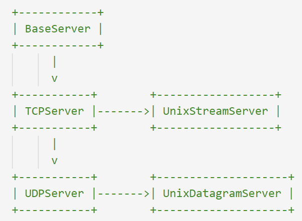
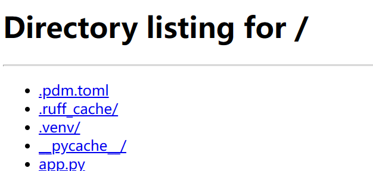
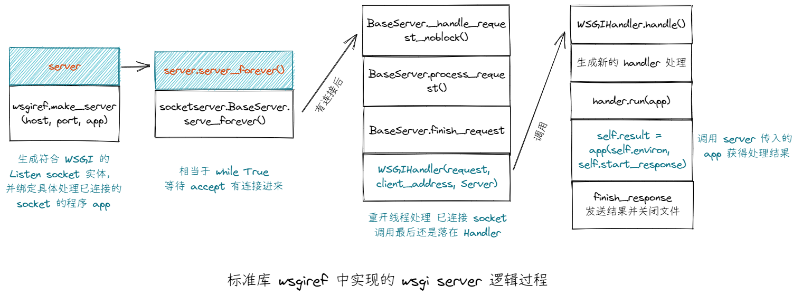
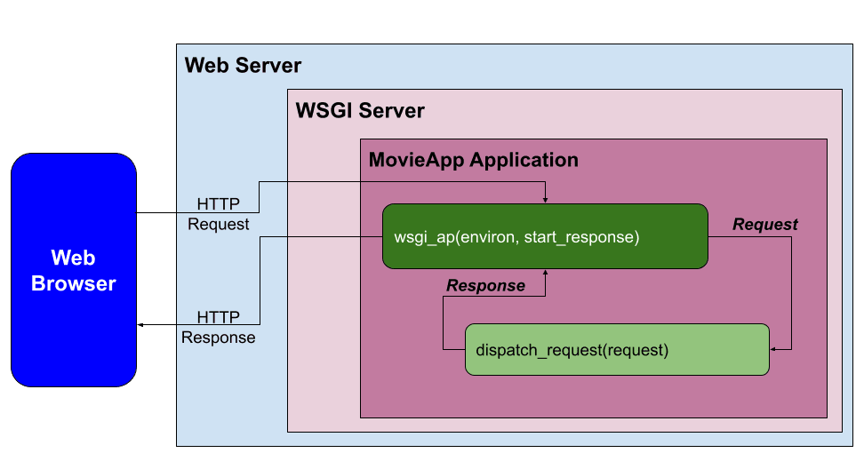
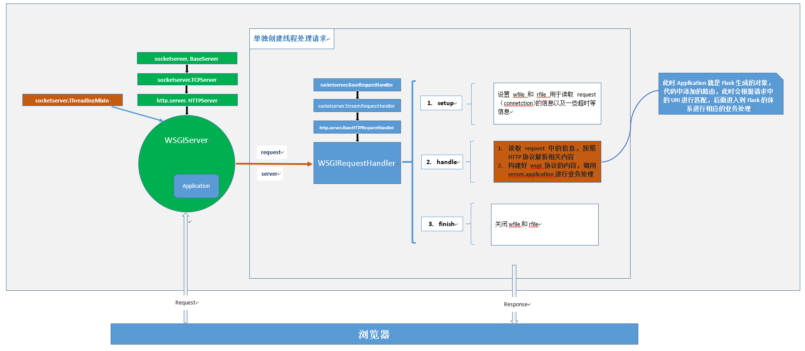
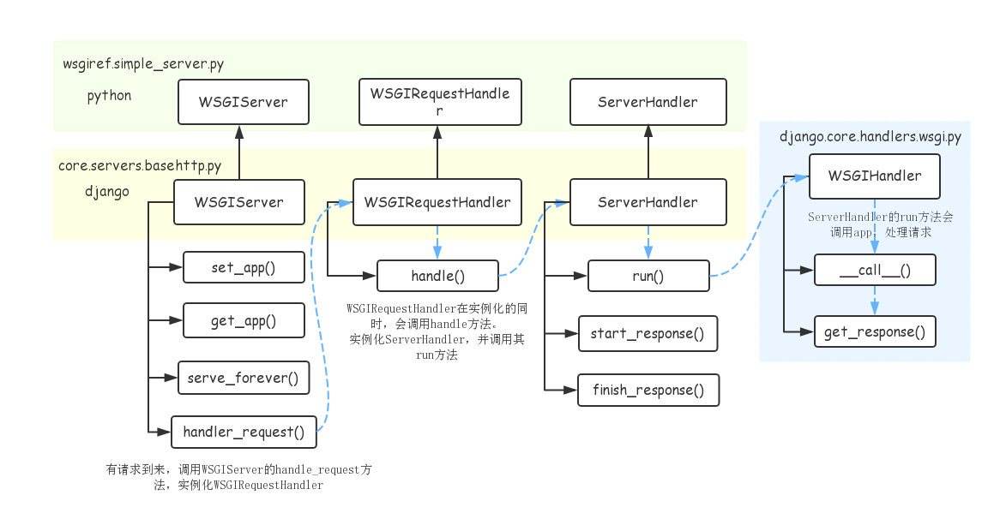

Socket 是一种网络通信协议的接口实现，它允许计算机之间进行数据通信。学习 Socket 编程可以帮助你了解网络通信的基本原理和实现方法，这对于进行网络编程和网络安全方面的工作非常有帮助。以下是学习 Socket 编程的一些步骤：

1. 学习网络通信的基础知识，包括 TCP/IP 协议、网络拓扑结构、网络设备等。
2. 学习 Socket 编程的基本概念，包括 Socket 编程的基本流程、Socket 编程的套接字、Socket 编程的地址和端口等。
3. 学习 Socket 编程的基本操作，包括创建套接字、绑定套接字、监听套接字、连接套接字、发送数据、接收数据等。
4. 学习 Socket 编程的高级操作，包括多线程 Socket 编程、非阻塞 Socket 编程、异步 Socket 编程、Socket 编程的安全性等。
5. 实践 Socket 编程，编写一些简单的 Socket 程序，例如实现简单的聊天室、文件传输程序等。
6. 学习 Socket 编程的相关工具和框架，例如 Python 的 Socket 模块、Java 的 Socket API、C++ 的 Boost.Asio 等。
7. 学习 Socket 编程的安全性问题，包括网络攻击、防火墙、加密等。

总之，学习 Socket 编程需要系统地学习网络通信的基本知识和 Socket 编程的基本原理，同时需要进行实践和掌握相关工具和框架，最终掌握 Socket 编程的高级操作和安全性问题。

## TCP Sockets Server

- 简单实现
- 多客户端
- 事件驱动

### 简单实现

只能连接一个客户端，且只能连接一次

```python
import socket
from functools import partial


# 简单实现 TCP socket server
with socket.socket(socket.AF_INET, socket.SOCK_STREAM) as sock:
    sock.setsockopt(socket.SOL_SOCKET, socket.SO_REUSEADDR, True)
    sock.bind(("127.0.0.1", 8000))
    sock.listen(10)  # 全连接队列长度，也就是最大同时连接数

    client, _ = sock.accept()
    with client:
        for data in iter(partial(client.recv, 4096), b""):
            client.send(data.decode().upper().encode())
```

多次连接，但仍只能连接一个

```python
import socket
from functools import partial


# 简单实现 TCP socket server
with socket.socket(socket.AF_INET, socket.SOCK_STREAM) as sock:
    sock.setsockopt(socket.SOL_SOCKET, socket.SO_REUSEADDR, True)
    sock.bind(("127.0.0.1", 8000))
    sock.listen(10)  # 全连接队列长度，也就是最大同时连接数
	while True:  # ++++++ 增加改行 +++++
        client, _ = sock.accept()
        with client:
            for data in iter(partial(client.recv, 4096), b""):
                client.send(data.decode().upper().encode())

```

多次连接，且通过**多线程**实现同时连接多个

```python
import socket
from functools import partial
from concurrent.futures import ThreadPoolExecutor

tpool = ThreadPoolExecutor(10)  # 10 个线程


def client_thread(client):
    with client:
        for data in iter(partial(client.recv, 4096), b""):
            client.send(data.decode().upper().encode())


# 简单实现 TCP socket server
with socket.socket(socket.AF_INET, socket.SOCK_STREAM) as sock:
    sock.setsockopt(socket.SOL_SOCKET, socket.SO_REUSEADDR, True)
    sock.bind(("127.0.0.1", 8000))
    sock.listen(10)  # 全连接队列长度，也就是最大同时连接数

    while True:
        try:
            client, _ = sock.accept()
            tpool.submit(client_thread, client)
        except Exception:
            pass

```

多次多个连接，**IO多路复用**方式

```python
import socket
import selectors


def run(address: str, port: int):
    """启动 TCP Server"""
    sock = socket.socket(socket.AF_INET, socket.SOCK_STREAM)
    sock.setsockopt(socket.SOL_SOCKET, socket.SO_REUSEADDR, True)
    sock.bind((address, port))
    sock.listen(100)
    sock.setblocking(False)

    def accept(sock, mask):
        """有新的连接"""
        print(sock)
        client, _ = sock.accept()
        client.setblocking(False)
        sel.register(client, selectors.EVENT_READ, connect)

    def connect(sock, mask):
        if mask & selectors.EVENT_READ:
            recv_data = sock.recv(1024)
            if recv_data:
                # TODO 处理数据
                sock.send(recv_data)
                # sel.modify(sock, selectors.EVENT_WRITE)
            else:
                # 关闭连接
                sel.unregister(sock)
                sock.close()

    sel = selectors.DefaultSelector()
    sel.register(sock, selectors.EVENT_READ, accept)
    while True:
        events = sel.select()
        for key, mask in events:
            func = key.data
            func(key.fileobj, mask)


if __name__ == "__main__":
    run("127.0.0.1", 8000)

```

上面简单实现了 TCP server，实际上标准库中也提供了简单的 TCP Server 实现——`socketserver`。



server_forever 就是处理有连接进来的 accept方法，内部也是IO多路复用；handle_request 则是处理每次连接后的 recv处理。handle_request 则是继续调用了 Handler 来实现，Handler 有一个重要方法handle() 来处理自己对数据的处理逻辑。

```python
import socketserver


class MyHandler(socketserver.StreamRequestHandler):
    def handle(self) -> None:
        # 处理具体的数据
        try:
            data = self.rfile.readline(3)
            # 需要全部读取
            ...
        except TimeoutError:
            # a read or a write timed out.  Discard this connection
            return


class TCPServer(socketserver.TCPServer):
    allow_reuse_address = True


server = TCPServer(("127.0.0.1", 8000), MyHandler)
server.serve_forever()

```

## Python HTTP Server

Python 内部实现了一个简单的 http server，`http.server`，里面有 HTTPServer、ThreadingHTTPServer 等接收连接的socket，还针对 HTTP 请求（已连接socket）对数据进行操作的 handler。

> 如果自己解析需要针对 HTTP 数据结构进行解析 TCP 接收到的二进制数据，这里省略了。有兴趣的可以查看[Socket Programming in Python (Guide) – Real Python](https://realpython.com/python-sockets/#application-client-and-server) 来了解实现原理。

BaseServer -> TCPServer -> HTTPServer -> ThreadingHTTPServer

> BaseServer、TCPServer 在标准库的 `socketserver`中

BaseRequestHandler -> StreamRequestHandler ->BaseHTTPRequestHandler

```python
from http.server import SimpleHTTPRequestHandler, HTTPServer

# 简单的文件管理服务器
server = HTTPServer(("127.0.0.1", 8000), SimpleHTTPRequestHandler)
server.serve_forever()

```

浏览器打开 127.0.0.1:8000



或者

```python
from http.server import BaseHTTPRequestHandler, HTTPServer


class Handler(BaseHTTPRequestHandler):
    def do_GET(self):
        # 接收 get 请求处理
        pass


server = HTTPServer(("127.0.0.1", 8000), Handler)
server.serve_forever()

```

核心就是 server 和 handler。

## Python WSGI Server

WSGI 是一种 web 服务器和 web 应用间通信的规范，是针对的请求数据的格式和解析（就像 Type-C 一样，手机有这个接口就可以使用对应充电器，但你完全可以不生产 Type-C 接口的手机只要找到对应充电器就可以）。在 HTTP Server 基础上增加对 request 的封装，和对 request 处理的拆分，原来的 Server 和  Handler，进一步被封装成 WSGI Server（增加 wsgi 相关 env，将app具体处理 request的应用与 server 结合）、WSGI Handler（将handle 方法进一步调用 run 方法，run方法则是进一步调用了 application方法来处理）



> WSGI 规范实际上就是规范了 env 和定义了 app 格式。

app 必须可调用，且需要 environ 和 start_response 作为参数，并返回 iterator 。其中 environ 相当于 request，start_resposne 是回调函数，用于生成状态码和响应头，最后的返回值作为响应体。

```python
from wsgiref.simple_server import make_server


def app(environ, start_response):
    print(environ)
    start_response("200 OK", [("Content-Type", "text/plain; charset=utf-8")])
    return [b"hello world"]


with make_server("127.0.0.1", 8000, app) as server:
    server.serve_forever()
```


更多内容

- [python wsgiref 源码阅读 - 游戏不存在 (game404.github.io)](https://game404.github.io/post/python/wsgiref/)
- [PEP 333 – Python Web Server Gateway Interface v1.0 | peps.python.org](https://peps.python.org/pep-0333/)
- [PEP 3333 – Python Web Server Gateway Interface v1.0.1 | peps.python.org](https://peps.python.org/pep-3333/)
- [WEB开发——Python WSGI协议详解_慕课手记 (imooc.com)](http://www.imooc.com/article/286785)

## 最小的 HTTP Server

Dev TCP Server 和 Reuqest/Response Application。

- Server：启动 HTTP 服务，不是应用必需，但方便开发
- Request：对 environ 的封装
- Response（Exception）对 返回值的封装
- url router 处理不同url请求

```python
from dataclasses import dataclass, field
from wsgiref.simple_server import WSGIServer, WSGIRequestHandler
from typing import Any, Iterable, Callable
import re
from urllib.parse import parse_qs
import json
from http import HTTPStatus


@dataclass
class Request:
    method: str
    content_length: int
    path: str
    query_params: list[dict[str, list[str]]] = field(default_factory=list)
    body: Any = None


@dataclass
class Response:
    body: Any
    status_code: int = HTTPStatus.OK
    content_type: str = "text/plain"


@dataclass
class APIResponse(Response):
    content_type: str = "application/json"


class APIException(APIResponse, BaseException):
    pass


class Web:
    router: list[tuple[re.Pattern, Callable]] = []

    def rotue(self, path: str) -> Callable:
        def decorator(func):
            self.router.append((re.compile(path + "$"), func))
            return func

        return decorator

    def find_route_func(self, path: str) -> Callable | None:
        for r in self.router:
            if r[0].match(path):
                return r[1]

    def _parse_request(self, environ: dict[str, Any]):
        request = Request(
            method=environ["REQUEST_METHOD"],
            content_length=int(environ.get("CONTENT_LENGTH", 0) or 0),
            path=environ["PATH_INFO"],
            query_params=parse_qs(environ["QUERY_STRING"]),  # type: ignore
        )
        body = environ["wsgi.input"].read(request.content_length).decode("utf-8")
        try:
            body = json.loads(body)
        except Exception:
            body = parse_qs(body)

        request.body = body
        return request

    def _parse_response(
        self, response: Response | APIResponse, start_response: Callable
    ):
        start_response(
            f"{str(response.status_code)} {HTTPStatus(response.status_code).phrase}",
            [("Content-Type", f"{response.content_type}; charset=utf-8")],
        )
        return (
            [response.body.encode("utf-8")]
            if isinstance(response.body, str)
            else [json.dumps(response.body).encode("utf-8")]
        )

    def __call__(self, environ: dict[str, Any], start_response: Callable) -> Iterable:
        request = self._parse_request(environ)  # 1. parse request
        func = self.find_route_func(request.path)  # 2. 根据 url route 匹配处理函数
        if func is None:
            return self._parse_response(APIException("", 404), start_response)
        try:
            response = func(request)
        except APIException as e:
            response = e
        except Exception as e:
            print(e)
            response = APIException({"msg": "server error"}, 500)
        return self._parse_response(response, start_response)

    def run(self, host: str = "127.0.0.1", port: int = 8000):
        server = WSGIServer((host, port), WSGIRequestHandler)
        server.set_app(self)  # 有连接时会调用 __call__ 方法
        try:
            server.serve_forever()
        except KeyboardInterrupt:
            print("\nexit.")

def main():
    app = Web()

    @app.rotue("/hello")
    def hello(request: Request):
        print(request)
        # raise APIException({"msg": "error"}, 401)
        # return Response("hello")
        return APIResponse({"name": "hello"})

    return app


if __name__ == "__main__":
    app = main()
    app.run()
    # $ http -v 127.0.0.1:8000/hello?name=12  msg='你好'
```

上面的 server 可以使用`python web.py` 启动，也可以使用 `gunicorn -w 4 web:main()` 启动。

## Flask 源码





### Request

重要参数：url 、path and parameter。

以 `http http://127.0.0.1:8000 name==xiao skill==1 skill==2 c:=[1,2,3] d:=1` 为例

> http 中 query string 使用 param==value 表示
>
> json 数据使用 data:=value 表示
>
> form 数据可以使用 -f 参数 后使用 data=value 表示

```sh
# TODO 常用 request 属性
# 由于 table 显示不正常，暂时隐去
```

> MultiDict 是专门针对可能有重复值的情况设计，get方法获得第一个值，getlist 获得所有值。

### Response

header + body

header中重要的两个是 status_code 和 content-type。

```python
Response(
    response=None,  # body 部分，Iterable[bytes | str] 或者 bytes | str 或者 None
	status=None,  # status int | str | HTTPStatus | None
    headers=None,  # 响应头{name: value} | [(name, value)]
    mimetype=None,  # 响应头 str | None，只能是 'application/json' 这种形式
    content_type=None,  # str|None 覆盖minetype,且可设置 'application/json;charset=utf8'
    direct_passthrough=False,  # bool，是否直接返回结果，不进行bytes判断，一般 False
)
```


[Lyon's Blog! (lyonyang.github.io)](https://lyonyang.github.io/blogs/#/flask/start)

[如何使用contextvars模块和源码分析 - So1n blog](https://so1n.me/2019/06/13/contextvars模块/)

[解读contextvars，在异步环境下生成全局的redis连接 - Totoro](https://totoro.site/index.php/archives/117/)

[Deep Dive into Flask's Application and Request Contexts | TestDriven.io](https://testdriven.io/blog/flask-contexts-advanced/)

[Local，localStack，localProxy深入解析 - 易迟的博客 | Bryan Blog (hustyichi.github.io)](https://hustyichi.github.io/2018/08/22/LocalProxy-in-flask/)

## Web 框架

[Py西游攻关之IO model - Yuan先生 - 博客园 (cnblogs.com)](https://www.cnblogs.com/yuanchenqi/articles/5722574.html)

[IO 多路复用之 epoll · Python Server Tutorial (sanyuesha.com)](https://sanyuesha.com/python-server-tutorial/book/ch08.html)

[selectors --- 高级 I/O 复用库 — Python 3.11.1 文档](https://docs.python.org/zh-cn/3/library/selectors.html)

[Deep Dive into Flask's Application and Request Contexts | TestDriven.io](https://testdriven.io/blog/flask-contexts-advanced/)
