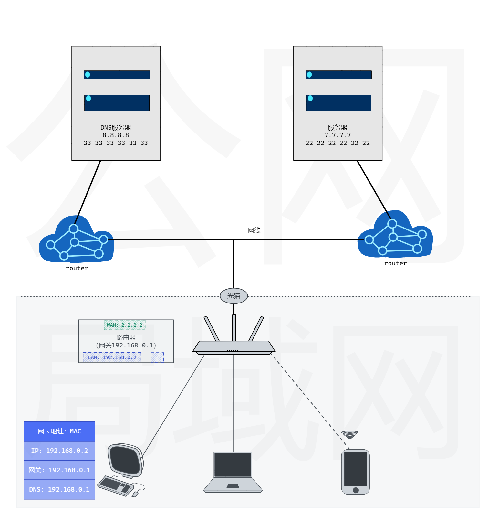
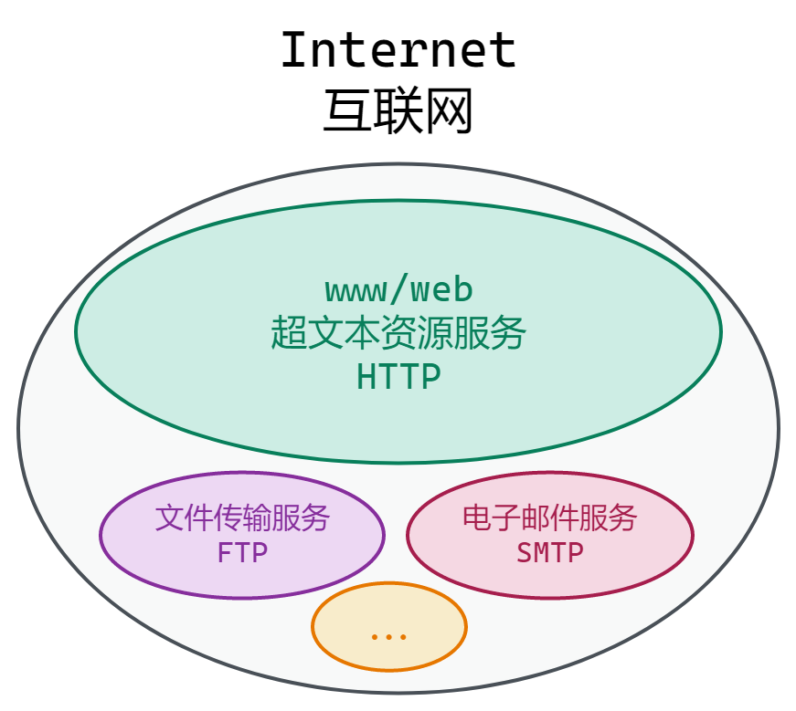
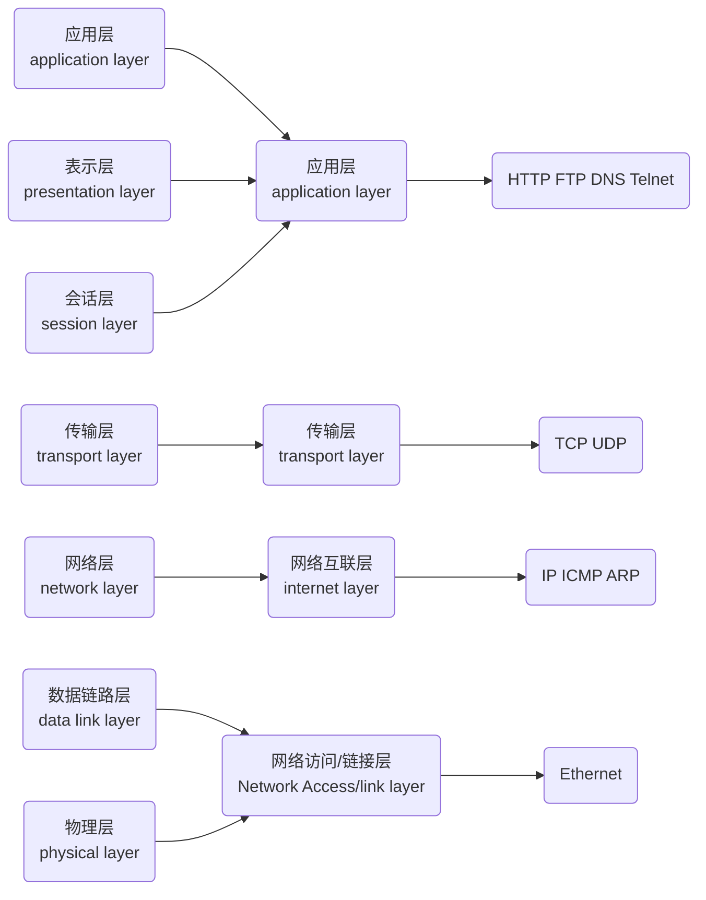
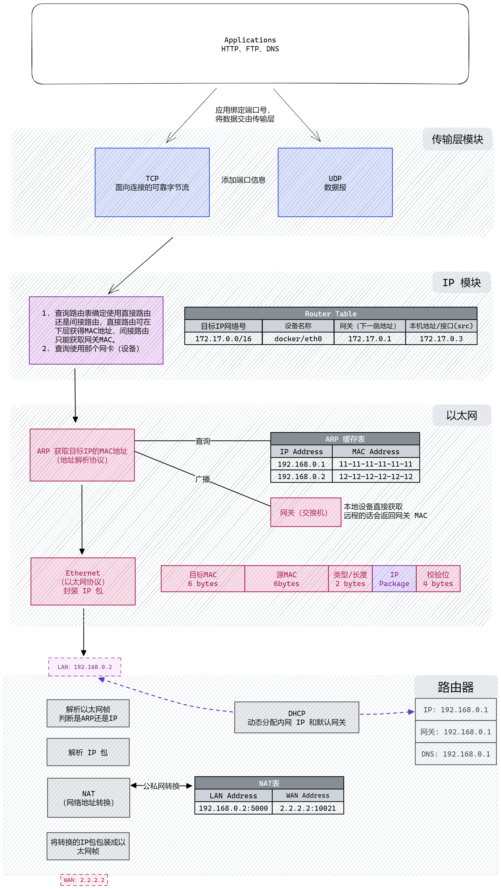
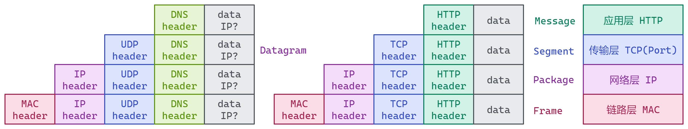
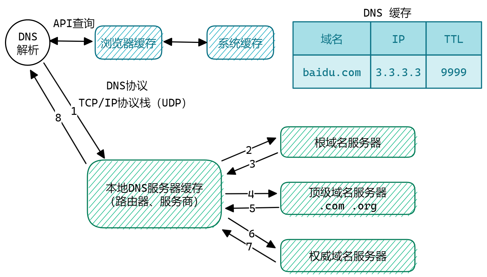

## 通过浏览网页回顾 TCP/IP 协议栈

**浏览网页**实际是请求超文本资源的过程。而绝大多数提供超文本资源的服务都是在不同计算机上部署。所以就是**去其它计算机（服务器）上请求超文本资源**的过程。

## 如何访问其它计算机

### 物理拓扑图

计算机间通信的物理连接基础路线图。

- 服务器就是要访问的另一个计算机
- 手机、电脑等是客户端
- 中间经过多种设备和线路进行连接



### 逻辑通信关系

- **Internet（互联网）**：将全世界计算机通过协议（TCP/IP协议簇）和设备连接起来的巨大网络。
- **万维网（Wide World Web，www/Web）**：在Internet网络中提供超文本（主要是HTTP）资源（URI）的服务形成的网络。
- **HTTP**：万维网的应用层基本实现。传输超文本资源。



浏览器就是万维网客户端，提供了HTTP访问服务。所以浏览网页也就是**使用万维网服务（主要是HTTP协议）**去其它计算机上请求超文本资源的过程。而万维网又是在互联网的基础上，所以访问其它计算机（*这里特指发起网页访问*）就是基于TCP/IP协议栈（包括HTTP）的数据传输过程。

这里再总结一下：**访问网页就是：去其它计算机上请求超文本资源的过程。而访问其它（万维网）计算机需要依赖TCP/IP协议栈。**

### TCP/IP 协议栈——计算机内部的数据包装

TCP/IP协议栈是由一系列协议组成（最著名的是这两个，所以由此命名），它是为了规范计算机之间的通信而提出的约束，分层处理，每层各司其职，将数据进行加工处理，最后通过光电信号进行传输。

> **TCP/IP协议栈起始于第二层协议IP(网络互联协议)。**

OSI七层模型、TCP/IP四层模型、主要协议。



每个协议定义如何在各个终端间进行通信。每层扮演不同角色，处理相应事务。


- TCP/IP（传输层）：将端口与应用数据绑定。
- IP：IP router 根据目标ip判断间接路由还是直接路由，并决定下层链路层要去往的设备。incoming包判断是向上层传递还是转发。
- Ethernet（以太网）：**同一介质**内的数据**传输**，搭载的是 IP 包。通过ARP获得要发送的IP对应的MAC地址。



数据结构



## 请求具体过程

发起请求使用的是**域名**：人类容易记忆的字符串。而计算机在网络中通信使用的是**IP**（数字），所以有了**DNS**（Domain Name System）来讲域名映射成IP。当输入`baidu.com`时，首先进行的就是DNS解析。

### DNS 查询



DNS构建一个DNS协议包查询 baidu.com IP。通过一系列访问，最终获得对应关系并存储在不同级别缓存中。最常用的DNS是基于UDP的（也有基于TLS、TCP等）。另外DNS服务一般使用**53端口号**。

### HTTP请求

#### TCP 三次握手

TCP协议是两台电脑间进程通信的一种协议。发送HTTP请求，需要先建立进程间连接，然后再将HTTP数据发送到指定端口，就可以将数据发送出去。而TCP是面向连接的（会在客户端和服务端两侧的TCP模块维护某些状态信息形成虚拟通道）。

#### TLS握手

四次握手TLS1.2  1.3是两次。

#### 传输

请求-响应

#### TCP挥手

四次挥手。

## 用到的命令

```bash
#### 应用层
# http
http host  # or curl host
# dns
dig host  # 查询 dns 信息

#### socket api
# socket statistic，已连接的 socket 信息统计，不同于 nc的建立连接，这里统计的是已建立的连接
ss -natl  # numeric all tcp listening
ss -t src :443  # 连接到本地端口 443 的所有TCP套接字
# 查找端口所对应的进程
sudo lsof -i :443
# 检查某个文件所对应的进程
sudo lsof /var/log/error.log

#### TCP
# 扫描端口，netcat 是TCP/UDP连接和监听工具，也可扫描端口是否可用
nc -zv host port
# or nmap专门用于扫描端口
nmap host  # 扫描所有
nmap -p port host  # 扫描某个端口

#### 网络层（ip）
# ip地址（mac地址、mtu、up）等设备信息
ip -s addr [show dev eth0]  # 显示特定接口的ip信息
# 路由表
ip route
# ICMP协议
ping host/ip  # 网络连通性
traceroute host  # 跟踪跳转路径（路由）

#### 链路层
# arp表
ip neighbour
# mac地址
ip -s link
```

## 参考

[[译\] RFC 1180：朴素 TCP/IP 教程（1991）](http://arthurchiao.art/blog/rfc1180-a-tcp-ip-tutorial-zh/)

[从输入URL到Web页面呈现的全过程](https://heapdump.cn/article/5410979)

[Deprecated Linux networking commands and their replacements](https://dougvitale.wordpress.com/2011/12/21/deprecated-linux-networking-commands-and-their-replacements/)

[节点搭建系列(1)：网络通信的基本过程，访问网站到底发生了什么事情？详细解析DNS原理](https://www.youtube.com/watch?v=_618At72evs&t=16s)
