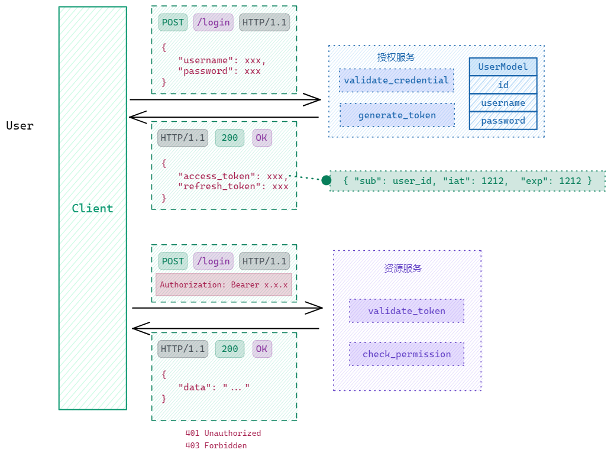

HTTP 是无状态的，所以每次请求都需要携带身份信息。身份信息可以是**用户名密码**，也可以是 **token**。身份信息的验证可以在每个请求中进行，也可以在每个请求之前进行。后者的好处是可以将验证逻辑抽离出来，方便管理。

::: details 前提概念解释
- `OAuth2` 是一种规范（specification）指导，定义了处理身份认证（Authentication）和授权（Authorization）的几种方式，包括但不限于 token、用户名密码等。
- `OpenAPI` 是构建 Web API 的开放规范（落地标准）。它在 security scheme （安全方案）中集成了 OAuth2 规范。
  - `Security Scheme` 中定义了许多安全性的 type，用于规范安全认证和验证过程。包括 apikey、http、oauth2、openIdConnect 等。
    - apikey：在header、query 或 cookie 中传递 api 密钥。比如在 url中加入`?apikey=xxx`。
    - http：标准的 HTTP 认证系统，包括 baisc、bearer、digest等方案。常用的是 一个带有值为 `Bearer` 的 `Authorization` 头部加上一个令牌，它也是从 OAuth2 继承而来的。
    - **oauth2（flows）**：目前流行的处理认证和授权的方案标准。
      - authorizationCode flow：基于 oauth2 的第三方认证。
      - clientCredentials flow: 基于 oauth2 的第三方认证。
      - **password flow**：最简单的认证，可以直接在同一个应用中使用。
    - openIdConnect：自动获取OAuth2 认证数据，属于 OpenID Connect 规范（基于 OAuth2 并扩展了的规范）。
    - mutualTLS 等


::: code-group
```yaml [oauth2]
type: oauth2
description: Optional for security scheme
flows:
  password:
    tokenUrl: https://example.com/api/oauth/token
    refreshUrl: https://example.com/api/oauth/refresh-token
    scopes:
      write:pets: modify pets in your account
      read:pets: read your pets
  authorizationCode:
    authorizationUrl: https://example.com/api/oauth/dialog
    tokenUrl: https://example.com/api/oauth/token
    scopes:
      write:pets: modify pets in your account
      read:pets: read your pets
```

```yaml [apikey]
type: apiKey
description: Optional for security scheme
in: query
name: apikey
```

```yaml [http bearer]
# （与 OAuth2 的 password 使用一致的 JWT）将 token 添加 `Bearer ` 后添加到 header 的 Authorization 中
type: http
scheme: bearer
bearerFormat: JWT
```

```yaml [http basic]
# 每次请求都使用用户名和密码，base64编码添加 `Basic ` 前缀后添加到 header 的 Authorization 中
type: http
scheme: basic
```
:::

## 认证

- 认证（Authentication）：你是谁？
  - 用户名密码：最常见的认证方式。
  - token：一串随机字符串，可以是 jwt、session 等。相较于用户名密码，token 更加安全，因为它不会暴露用户的密码。token 也可以设置过期时间，可以有效的减少服务器的压力。



## 鉴权

- 鉴权（Authorization）：你能做什么？
  - 是否具有操作权限（Who can do What in Which Object），比如RBAC。

使用基于 RBAC 的权限管理系统。

Access Control List

| 权限/角色 | 管理员 | 撰稿者 | 普通用户 |
| :-------: | :----: | :----: | :------: |
| 查看文章  |   ✓    |   ✓    |    ✓     |
| 发布文章  |   ✓    |   ✓    |          |
| 编辑文章  |   ✓    |   ✓    |          |
| 删除文章  |   ✓    |   ✓    |          |
| 点赞文章  |   ✓    |   ✓    |    ✓     |
| 评论文章  |   ✓    |   ✓    |    ✓     |

TODO 前端菜单和按钮权限资源？是否可以合并

| resource_id | name     | type    | parent_id |
| ----------- | -------- | ------- | --------- |
| 1           | 用户管理 | menu    | NULL      |
| 2           | 角色管理 | menu    | NULL      |
| 3           | 权限管理 | menu    | NULL      |
| 4           | 日志管理 | menu    | NULL      |
| 5           | 用户列表 | submenu | 1         |
| 6           | 新增用户 | button  | 1         |
| 7           | 编辑用户 | button  | 1         |
| 8           | 删除用户 | button  | 1         |
| 9           | 角色列表 | submenu | 2         |
| 10          | 新增角色 | button  | 2         |
| 11          | 编辑角色 | button  | 2         |
| 12          | 删除角色 | button  | 2         |
| 13          | 权限列表 | submenu | 3         |
| 14          | 新增权限 | button  | 3         |
| 15          | 编辑权限 | button  | 3         |
| 16          | 删除权限 | button  | 3         |
| 17          | 登录日志 | submenu | 4         |
| 18          | 操作日志 | submenu | 4         |

## Secuirity

- XSS (Cross-Site Scripting) 跨站脚本攻击，使用 POST 方法输入用户名和密码时使用了某些特殊字符，如果后端没有过滤和校验，很可能会将数据库中的数据删除或者修改。或者存储在 localStorage 中的 token 被获取到，进行 CSRF 攻击。
- CSRF (Cross-Site Request Forgery) 如果 token 存储到 cookie 后，由于浏览器会自动携带 cookie，所以可以通过伪造请求进行 CSRF 攻击。
- TLS（HTTPS）

## References

- [The OAuth 2.0 Authorization Framework: Bearer Token Usage](https://datatracker.ietf.org/doc/html/rfc6750) OAuth 2.0 规范
- [Web Authentication Methods Compared](https://testdriven.io/blog/web-authentication-methods/)
- [CSRF Protection in Flask](https://testdriven.io/blog/csrf-flask/)
- [Introduce OAuth 2.0 — Authlib 1.2.0 documentation](https://docs.authlib.org/en/latest/oauth/2/intro.html#intro-oauth2)
- [Security Intro - FastAPI](https://fastapi.tiangolo.com/tutorial/security/)
- [Intro to IAM - Learn about Identity Access Management - Auth0](https://auth0.com/intro-to-iam)
-
