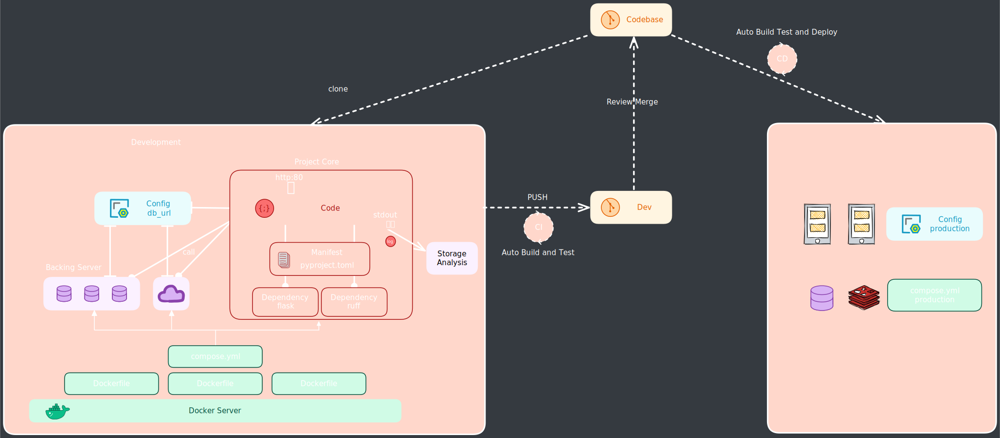

开箱即用的 flask + Gunicorn + Nginx + Docker Web Application 开发、部署方案。满足 [12 factor](https://12factor.net/) Web 开发指导原则和 [CI/CD](https://zh.wikipedia.org/wiki/CI/CD) 开发流程。



## Features

- 弹性扩展
- 持续更新
- 可移植性
- 可配置性
- CI/CD

## 开发工具 Tools

开发工具不在 12 factor 之内，但是不同工具对于开发效率和开发体验有很大影响。下面是我使用的工具：

- [WSL2](https://learn.microsoft.com/en-us/windows/wsl/about#what-is-wsl-2) (Windows Subsystem for Linux 2): Linux 内核的 Windows 子系统，可以在 Windows 上运行 Linux 程序。
- [VS Code](https://code.visualstudio.com/): IDE
  - [ms-vscode-remote.remote-wsl](https://marketplace.visualstudio.com/items?itemName=ms-vscode-remote.remote-wsl): 在 WSL2 中运行 VS Code
  - [ms-python.python](https://marketplace.visualstudio.com/items?itemName=ms-python.python)
  - [ms-python.vscode-pylance](https://marketplace.visualstudio.com/items?itemName=ms-python.vscode-pylance): Static type checker (static code logic)
  - [tamasfe.even-better-toml](https://marketplace.visualstudio.com/items?itemName=tamasfe.even-better-toml) toml language support
  - [ms-python.black-formatter](https://marketplace.visualstudio.com/items?itemName=ms-python.black-formatter): Formatter (code style)
  - [charliermarsh.ruff](https://marketplace.visualstudio.com/items?itemName=charliermarsh.ruff): linter (code style and static code logic and code recommend)
  - [njpwerner.autodocstring](https://marketplace.visualstudio.com/items?itemName=njpwerner.autodocstring)

- [Python](https://www.python.org/) 3.11.3
  - [PDM](https://pdm.fming.dev/latest/): Project and virtualenv management with dependencies (pyproject.toml)

## 代码库 Codebase

- 使用 Git 进行项目版本控制，维护远程仓库一份 codebase（main分支），并进行本地多分支（功能分支）开发。

详情：[git](./git.md)

## 开发依赖 Dependency

依赖要显示声明和项目隔离。

- 项目依赖清单: pyproject.toml （包括开发和生产）[PEP518](https://peps.python.org/pep-0518/)、[PEP 621](https://peps.python.org/pep-0621/)、[more](https://packaging.python.org/en/latest/specifications/declaring-project-metadata/#declaring-project-metadata)
- 项目依赖管理工具: [PDM](https://pdm.fming.dev/latest/)（还包括虚拟环境管理、项目管理、构建管理）

::: code-group
```sh
# 初始化项目，包括创建虚拟环境、创建 pyproject.toml、.gitignore
pdm init [-n]
# 安装依赖
pdm add flask
# 开发依赖
pdm add -d black ruff
```
:::

## 配置 Config

通常一个 web 服务器不止有 web app，还需要数据库、任务队列、消息队列、websocket等，他们中有些配置是重叠的有些是独有的，本文的目的即能在一个地方管理所有变量（配置项）。
将配置与代码分离存储在**环境变量**中（**.env 文件**）。这是多个部署环境可能发生变化的唯一地方（不同的.env文件）。包括：

- 后端服务资源
- 外部服务凭证
- 部署环境标识

统一放置环境变量，不同 APP 设置不同**前缀**。全部大写。

比如：

- `CELERY_`
- `WEB_`
- `MYSQL_`
- `REDIS_`
- `COMPOSE_`
- `SMS_`
- `COS_`

不包括：程序内部的配置（每个部署都不会改变的）。

::: danger 注意
不要将 env 文件提交到公开仓库，或将其移出版本管理。
:::

## 后端服务(支持) Backing Services

指应用通过网络或其它协议使用到的服务，如数据库、消息队列、缓存以及第三方服务。又统称 attached resources（附加资源）。

本地开发使用基于 Docker Compose 部署的后端支持服务以缩小与生产的环境差异，并支持只修改config来切换部署环境。

::: code-group
```sh [常用命令]
# 启动
docker compose up -d --build
# 删除容器和卷
docker compose down -v
# 运行命令
docker compose exec [-it] <name> [command]
```
:::

[More](./docker.md)

## 开发规范

PEP8 是官方出品的 code style，不少公司也有自己的一套 style，除了平时 coding 时注意遵循外，好的格式化工具和检查工具也是保证代码质量的必要环节。

::: tip
Code Quality: code style, code logic, code recommended (replace or upgrade).
:::

开发依赖中所涉及的 pyproject.toml 不仅可以管理依赖安装还能设置依赖配置。而VS Code中的插件也可以根据配置来进行代码格式化和检查。black、ruff 通过复用 `.gitignore` 进一步降低了配置复杂度 [here](https://black.readthedocs.io/en/stable/usage_and_configuration/file_collection_and_discovery.html#gitignore)。

::: code-group
``` sh [安装依赖]
pdm add -d black ruff
```
:::

::: warning
插件内置有 server ，即使不安装依赖也可以使用，但为了保证一致性还是在项目中管理依赖版本。插件会自动切换吗？
:::

::: code-group
```toml [pyproject.toml]
# https://black.readthedocs.io/en/stable/usage_and_configuration/the_basics.html#command-line-options
[tool.black] // [!code focus:2]
line-length = 120 // [!code warning]
required-version = "22.3.0"
# 23.1.0 之后将自动推断 python 版本
# target-version = ["py311"]

# https://beta.ruff.rs/docs/settings/
[tool.ruff] // [!code focus:70]
required-version = "0.0.270"
line-length = 120 // [!code warning]
# target-version = "py311" 自动推断

select = [
    "A",   # flake8-builtins
    "ANN",
    "B",   # flake8-bugbear
    "BLE", # flake8-blind-except
    "C4",  # flake8-comprehensions
    "C90", # mccabe
    "D",   # pydocstyle
    "DJ",  # flake8-django
    "DTZ", # flake8-datetimez
    "E",   # pycodestyle errors
    "ERA", # eradicate
    "EXE", # flake8-executable
    "F",   # pyflakes
    "G",   # flake8-logging-format
    # "I",   # isort
    "ICN", # flake8-import-conventions
    "ISC", # flake8-implicit-str-concat
    "N",   # pep8-naming
    "PIE", # flake8-pie
    "PLC", # pylint - convention
    "PLE", # pylint - error
    "PLW", # pylint - warning
    "PT",
    "PTH", # flake8-use-pathlib
    "Q",   # flake8-quotes
    "RET", # flake8-return
    "RUF", # Ruff-specific rules
    "S",   # flake8-bandit
    "SIM", # flake8-simplify
    "T10", # flake8-debugger
    "T20", # flake8-print
    "TCH", # flake8-type-checking
    "TID", # flake8-tidy-imports
    "UP",  # pyupgrade
    "W",   # pycodestyle - warning
    "YTT", # flake8-2020
]
ignore = [
    "D100",   # pydocstyle - missing docstring in public module
    "D101",   # pydocstyle - missing docstring in public class
    "D102",   # pydocstyle - missing docstring in public method
    "D103",   # pydocstyle - missing docstring in public function
    "D104",   # pydocstyle - missing docstring in public package
    "D105",   # pydocstyle - missing docstring in magic method
    "D106",   # pydocstyle - missing docstring in public nested class
    "D107",   # pydocstyle - missing docstring in __init__
    'D211',
    'D213',
    'ANN101',
    'ANN102',
    'ANN401',
    'N818',
]
respect-gitignore = true

[tool.ruff.per-file-ignores]
"__init__.py" = ["F401"]

[tool.ruff.pydocstyle]
# Use Google-style docstrings.
convention = "google"

[tool.ruff.flake8-builtins]
builtins-ignorelist = ["id"]

```

```sh [run]
pdm run black . // [!code focus]
# only check
pdm run black --check .

pdm run ruff check . // [!code focus]
# auto fix
pdm run ruff check --fix .
```

::: details ruff rules

| 代号    | 原有库                                              | 功能                                                         |
| ------- | --------------------------------------------------- | ------------------------------------------------------------ |
| **F**   | pyflakes                                            | code logic                                                   |
| **E**   | [pycodestyle](https://github.com/PyCQA/pycodestyle) | pep8 基础规范, 不包括 naming docstring                       |
| **W**   | pycodestyle                                         | pep8 基础规范                                                |
| D       | pydocstyle                                          | `docstring conventions` 补充 pycodestyle                     |
| N       | pep8-naming                                         | `naming conventions` 补充 pycodestyle                        |
| A       | flake8-builtins                                     | 是否覆盖了内置变量名 pep8-naming                             |
| **B**   | flake8-bugbear                                      | (opinionated) 补充 pyflakes 和 pycodestyle （较杂乱）        |
| PIE     | flake8-pie                                          | 没有必要的 pass 或多余 `**` 补充 pyflakes 和 pycodestyle 的杂项 |
| **C4**  | flake8-comprehensions                               | recommend `comprehension` replace                            |
| DTZ     | flake8-datetimez                                    | datetime recommend `tzinfo` replace                          |
| **PTH** | flake8-use-pathlib                                  | recommend `pathlib` replace                                  |
| **SIM** | flake8-simplify                                     | 简化语句或调用 recommend code replace                        |
| **UP**  | pyupgrade                                           | upgrade syntax for newer versions                            |
| ANN     | flake8-annotations                                  | 函数是否使用 annotations，与 mypy 相辅相成                   |
| TCH     | flake8-type-checking                                | imports to move in or out of type-checking blocks            |
| C90     | mccabe                                              | `function complex` 复杂度检查                                |
| Q       | flake8-quotes                                       | 引号相关                                                     |
| S       | flake8-bandit                                       | security 比如硬编码密码                                      |
| I       | isort                                               | import sorted                                                |
| BLE     | flake8-blind-except                                 | 检查 except                                                  |
| PT      | flake8-pytest-style                                 | pytest 相关                                                  |
| G       | flake8-logging-format                               | recomad logging use extra                                    |

:::

Static type checking with pylance(mypy)

Python 是强类型动态语言，需要运行时进行类型推导，这是他的优势但也是劣势。为了更好的在静态源码分析时发现问题，引入了 type hint，通过类型检查来增强编码质量和编辑提示。

::: details more about type hint
type annotation ([PEP 3107](https://peps.python.org/pep-3107/))只定义了函数注解，type hint ([PEP 484](https://peps.python.org/pep-0484/))范围更大。
pylance/mypy 是一个在编译时进行类型检查的工具。 pydantic 是一个 runtime type checking。
:::

::: code-group
```toml [pyproject.toml]
# https://mypy.readthedocs.io/en/stable/config_file.html#import-discovery
[tool.mypy]
# 如果不指定则按照 mypy 所依赖的环境
python_version = 3.11
strict = true
show_error_codes = true
ignore_missing_imports = true
check_untyped_defs = false
disallow_untyped_calls = false
disallow_untyped_decorators = false
```

```sh [run]
pdm run mypy .
```
:::

除了在开发时注重代码质量，在 git commit 时也要进行检查，通过后才能提交。

::: code-group
```sh [install]
pdm add -d pre-commit
```

```yaml [.pre-commit-config.yml]
repos:
  - repo: https://github.com/psf/black
    rev: 23.3.0
    hooks:
      - id: black
        language_version: python3.11
  - repo: https://github.com/charliermarsh/ruff-pre-commit
    rev: v0.0.270
    hooks:
      - id: ruff
```

```sh [init]
pdm run pre-commit install
```
:::

## CI/CD

push 到远程仓库时利用 Github Actions 再接受一道检验。

::: code-group
```yaml [.github/workflows/ci.yml]
name: CI
on: [push]

jobs:
  test:
    name: Testing
    strategy:
      fail-fast: false
      matrix:
        python-version: ['3.11']
        pdm-version: [2.4.2]
        os: [ubuntu-latest]
    runs-on: ${{ matrix.os }}
    steps:
      - uses: actions/checkout@v3
      - name: Set up PDM (with Python)
        uses: pdm-project.setup-pdm@v3
        with:
          python-version: ${{ matrix.python-version }}
          version: ${{ matrix.pdm-version }}
      - name: Install dependencies
        run: |
          pdm sync -d -G test
      - name: Run Test
        run: |
          pdm run pytest --cov=./ --cov-report=xml tests
  # - name: Upload coverage to Codecov
  #   uses: codecov/codecov-action@v3

  code-quality:
    name: Code Quality
    strategy:
      fail-fast: false
      matrix:
        python-version: ['3.11']
        pdm-version: [2.4.2]
        os: [ubuntu-latest]
    runs-on: ${{ matrix.os }}
    steps:
      - uses: actions/checkout@v3
      - name: Set up PDM (with Python)
        uses: pdm-project.setup-pdm@v3
        with:
          python-version: ${{ matrix.python-version }}
          version: ${{ matrix.pdm-version }}
      - name: Install dependencies
        run: |
          pdm sync -d
      - name: Run Black
        run: |
          pdm run -v black . --check --exclude=tests/
      - name: Run Ruff
        run: |
          pdm run -v ruff --format=github .
      - name: Run Mypy
        run: |
          pdm run -v mypy . --prety
      - name: Run Safety
        run: pdm run -v safety check
```
:::

build relase run.

部署时 nginx 端口映射

## 高可用

- 数据隔离（多个app作为独立进程对数据进行操作，进程不存储信息）
- 支持并发（横向扩展）：多线程、多进程（多机器）服务，sign

## 监控

- log 开发不关心具体输出到哪里，统一 stdout，开发直接输出，生成由部署环境决定。

## Reference

- https://12factor.net/
- https://jenciso.github.io/blog/12-factor-app/
