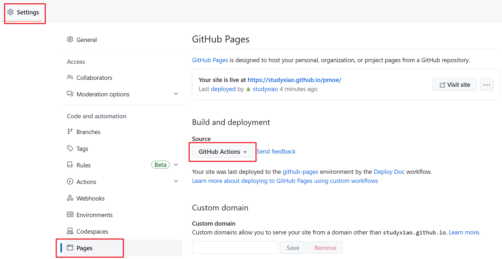

# Code Documentation Management of Project Workflow

::: tip 说明
Document Type: user documents and development documents.

Document Format: comment(注释) docstring（文档字符串） markdown（文档）。
:::

## 安装依赖

- [mkdocs](https://github.com/mkdocs/mkdocs)  markdown doc 生成
- [mkdocs-material](https://squidfunk.github.io/mkdocs-material/customization/)  mkdocs material style (default google)
- mkdocstrings[python]  # 将 python 文档字符串生成文档
- mdx-include  # 可以使用 `\{\! path \!\}` 形式嵌套 md 文件

```sh
pdm add -d -G doc mkdocs mkdocs-material mkdocstrings[python]
```
## 编写文档

```bash
# 创建 mkdocs 格式
mkdocs new .
# 会生成 docs/index.md 和 mkdocs.yml
```

### 配置

```yaml
site_name: PMoe

repo_url: https://github.com/studyxiao/pmoe
repo_name: studyxiao/pmoe

theme:
  name: material
  logo: ''
  language: zh
  palette:
    - scheme: default
      primary: pink
      accent: pink
      toggle:
        icon: material/weather-sunny
        name: Switch to dark mode
    - scheme: slate
      primary: pink
      accent: pink
      toggle:
        icon: material/weather-night
        name: Switch to light mode
  font:
    text: Open Sans
    code: Fira Code
  features:
    # - navigation.tabs
    # - navigation.tabs.sticky
    - navigation.top
    - toc.follow
    - search.suggest
    - content.code.copy
    - content.code.annotate
    - content.tabs.link
plugins:
  - mkdocstrings:
      handlers:
        python:
          options:
            docstring_style: google
  - search:
      lang:
        - en
      separator: '[\s\u200b\-]'
  - glightbox
nav:
  - Tips: index.md
  - Development:
      # - Project Structure: structure.md
      - Docker Service: docker.md
  - Workflow:
      - Code Qulity: code_quality.md
      - Documentation: docs.md
      - Git: git.md
  - 环境变量: env.md

markdown_extensions:
  - admonition
  - pymdownx.details
  - pymdownx.superfences
  - pymdownx.highlight:
      linenums: true
      anchor_linenums: true
      auto_title: true
  - pymdownx.inlinehilite
  - pymdownx.snippets
  - pymdownx.tabbed:
      alternate_style: true
  - tables
  - attr_list
  - md_in_html
  - pymdownx.emoji
  - toc:
      permalink: '#'
```

### md 文档

docs 文件夹下就是编写的 md 文档，编写后在 `mkdocs.yml` 文件的 `nav` 标签下引用即可。

### [PEP257-docstrings](https://peps.python.org/pep-0257/) 文档

在 yml 文件中加入 `plugins` 配置：
```yaml
plugins:
  - mkdocstrings
```

使用 docstring
在 docs/ 下的 markdown 文件中使用 `::: package.module` 自动引入文档字符串

引入一个 python 文件

## 启动

### 本地启动

```bash
pdm run mkdocs serve
```

### 部署

```bash
pdm run mkdocs build
# 创建 site/ 文件夹

# github 支持在仓库中创建 gh-pages 分支来提供在线文档，mkdocs 集成了操作，直接
mkdocs gh-deploy
# 该命令会自动build 并将结果推送到绑定的github 仓库下的 gh-pages 分支下
# 网址是：ttps://username.github.io/project-name/
```

github action 部署网站对于免费用户需要是公开仓库，且设置为 github action 自动部署。workflow 查看项目文件。



## Reference

[Documenting Python Code and Projects](https://testdriven.io/blog/documenting-python/)

[Build Your Python Project Documentation With MkDocs](https://realpython.com/python-project-documentation-with-mkdocs/)
