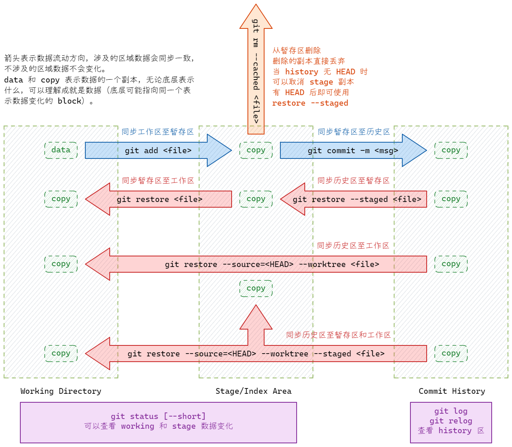
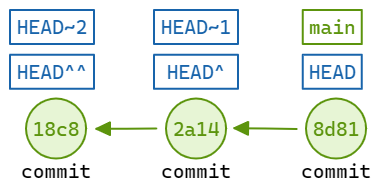

[git](https://git-scm.com/) 分布式版本控制软件。

## 初始配置

::: code-group
```sh [Init]
git config --global user.name "username" // [!code focus:3]
git config --global user.email "your_email@example.com"
git config --global init.defaultbranch "main"
# Windows 需要另加 启用 autocrlf
git config --global core.autocrlf input
```

```sh [SSH]
# 生成密钥
ssh-keygen -t ed25519 -C "your_email@example.com"

# 添加到 ssh-agent
eval "$(ssh-agent -s)"  # 当前 Shell 启动
ssh-add ~/.ssh/id_ed25519  # 添加密钥

cat ~/.ssh/id_ed25519.pub
# 把输出内容复制到 gitee github

# 测试
ssh -T git@<host> -p <port>

```
:::

## 项目开始

::: code-group
```sh [Local merge remote]
git init
git remote add origin git@github.com:<username>/<project>.git
git fetch orign
git branch --set-upstream-to=origin/main main
git pull origin main --rebase
# git add git commit git push
```

```sh [begin remote]
git clone git@github.com:<username>/<project>.git [local_name]
```
:::

## 常用操作

### 本地数据同步（流动）

- add
- commit [--amend]
- restore
- status
- log



::: code-group
```sh [Example]
#### 放弃本地修改
git restore <file>

#### 放弃提交暂存去数据
git restore --staged <file>
# 或者当前还没有本地 commit 时使用
git rm --cached <file>

#### 恢复某个历史区 commit 到本地和暂存区
git restore --source=<commit_id> --staged --worktree <file>

#### 追加 commit，小的修改(不会产生新的 commit)
git commit --amend --no-edit
```
:::

### 分支操作

- switch
- rebase
- branch
- tag
- merge

每次的 commit 操作都会在历史区生成一个<span style="color:red;font-weigt:700">快照</span>并加入到**链式管理**，每个快照都有 id，可以称为 commit。

- branch (分支)就是某一个链条（并指向链条的最新的 commit）。
- main 是某一个 branch，在 github 等仓库中作为主分支。
- HEAD表示当前 commit，随着提交不断向前。
- tag 也是指向某一个 commit，并永久不动。

::: tip
可以理解为：所有历史区操作操作的都是 **commit**，只不过有的 commit 有**别称**。
:::



::: code-group
```sh [切换分支]
# 从 main 创建一个分支并切换
git switch -c <branch_name> main
# 从远程分支创建
git switch -c <branch_name> origin/main

# 查看所有分支
git branch -a
```

```sh [删除分支]
# 切换到其它分支
git switch main
# 删除本地分支
git branch -D <branch_name>
# 删除远程分支
git push origin -d <branch_name>
```

```sh [合并分支]
# 切换其它分支
git switch main
# 将 dev 合并到 main
git merge dev
```

```sh [合并多个commit 为1个]
# -i 交互式选择 将 pick 改为 squash
git rebase -i HEAD~X
```
:::

## Reference

- https://devguide.python.org/getting-started/git-boot-camp/
- [How to change my Git username in terminal?](https://stackoverflow.com/questions/22844806/how-to-change-my-git-username-in-terminal)
- [using-multiple-github-accounts-with-ssh-keys](https://gist.github.com/oanhnn/80a89405ab9023894df7)
- [Git 的奇技淫巧](https://hellogithub.com/article/9aed28d4d64b4649bb364685ef557ae4)
- https://git-scm.com/docs/git-restore/zh_HANS-CN
