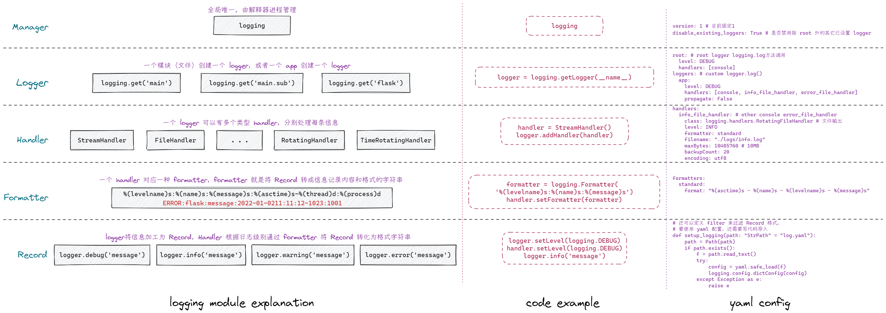

记录系统日志，以便信息追踪、排错优化。一般记录的信息有：

- 请求出错记录
- 慢查询记录
- 重要操作信息记录

## Python logging

Python 内置 logging 模块是线程安全的。



- Manager 用于管理所有 logger，相当于公司派遣员工。
- Logger 管理下面的 Handlers，现场指挥者。
- Handler 按照 Formatter 处理日志信息（从原材料到产品），小兵，真正干活的人。
- Formatter 日志信息格式，工业标准，按照标准生产信息。

一个Manager（公司）有多个 Logger（小组长）；每个 Logger（小组长）管理多个 handler （干活的）；每个 handler（操作员）按照 Formatter（标准）生产信息（Recoder）。

```python
import logging


# 1. 定义标准
formatter = logging.Formatter('%(levelname)s %(module)s %(lineno)d %(message)s')

# 2. 对接工人
handler = logging.StreamHandler()  # 输出流
handler.setFormatter(formatter)

# 3. 配备小组长（隐式找公司要）
logger = logging.getLogger('name')
logger.addHandler(handler)
logger.setLevel('info')  # 记录日志最低级别

# 4. 使用(提供原材料)
logger = logging.getLogger('name')
logger.info('给你点木头')
logger.warning('给你点铁器')
logger.error('给你点黄金')
```

### Formatter

```python
%(name)s      # logger name
%(levelno)s   # 日志级别数值 (DEBUG, INFO, WARNING, ERROR, CRITICAL)
%(levelname)  # 日志级别名称 ("DEBUG", "INFO", "WARNING", "ERROR", "CRITICAL")
%(pathname)s  # 当前执行程序的路径 sys.argv[0]
%(filename)s  # 当前执行程序文件名
%(module)s    # 当前模块，不带后缀的文件名
%(funcName)s  # 当前函数名
%(lineno)d    # 当前行号
%(asctime)s   # 日志生成时间
%(thread)d    # 当前线程ID
%(threadName)s# 线程名称
%(process)d   # 当前进程ID
%(message)s   # 日志信息
```

### Handler

```python
StreamHandler：logging.StreamHandler；日志输出到流，可以是sys.stderr，sys.stdout或者文件
FileHandler：logging.FileHandler；日志输出到文件
BaseRotatingHandler：logging.handlers.BaseRotatingHandler；基本的日志回滚方式
RotatingHandler：logging.handlers.RotatingHandler；日志回滚方式，支持日志文件最大数量和日志文件回滚
TimeRotatingHandler：logging.handlers.TimeRotatingHandler；日志回滚方式，在一定时间区域内回滚日志文件
SocketHandler：logging.handlers.SocketHandler；远程输出日志到TCP/IP sockets
DatagramHandler：logging.handlers.DatagramHandler；远程输出日志到UDP sockets
SMTPHandler：logging.handlers.SMTPHandler；远程输出日志到邮件地址
SysLogHandler：logging.handlers.SysLogHandler；日志输出到syslog
NTEventLogHandler：logging.handlers.NTEventLogHandler；远程输出日志到Windows NT/2000/XP的事件日志
MemoryHandler：logging.handlers.MemoryHandler；日志输出到内存中的指定buffer
HTTPHandler：logging.handlers.HTTPHandler；通过"GET"或者"POST"远程输出到HTTP服务器
```

### Level

```python
CRITICAL  # 50 致命错误，整个程序不能运行
ERROR     # 40 发生错误程序部分不能正常运行
WARNING   # 30 即将发生意外但不影响程序运行（默认级别）
INFO      # 20 确认程序按预期运行
DEBUG     # 10 调试过程中使用
NOTSET    # 0  输出所有
```

- WARN 也表示 WAARNING，FINAL 也表示 CRITICAL，这两个已经废弃，不再建议使用。

- 在设置级别时，可以 `setLevel(logging.DEBUG)` 或者字符串形式 `setLevel('DEBUG')`

### Logger

logging 有一个 **root logger**，可以通过 logging.**basicConfig**(level, format,...)设置对应handler和formatter，然后调用logging.warning('msg') 就可以记录日志，root logger 提供了 streamHander（控制台）和 FileHandler（文件）两种 handler。此logger 可以通过 `logging.getLogger()` 获得（即参数不指定名称，就是根记录器）。当我们指定了 root logger 的 handler 后就**不再**调用 basicConfig 函数了。

### yaml 配置文件

```yaml
version: 1
disable_existing_loggers: True

root: # root logger
  level: DEBUG
  handlers: [console]

loggers: # custom logger
  app:
    level: DEBUG
    handlers: [console, info_file_handler, error_file_handler]
    propagate: False

handlers:
  console:
    class: logging.StreamHandler
    level: DEBUG
    formatter: standard
    stream: ext://sys.stdout
  info_file_handler:
    class: logging.handlers.RotatingFileHandler
    level: INFO
    formatter: standard
    filename: ./logs/info.log
    maxBytes: 10485760 # 10MB
    backupCount: 20
    encoding: utf8
  error_file_handler:
    class: logging.handlers.RotatingFileHandler
    level: ERROR
    formatter: error
    filename: ./logs/error.log
    maxBytes: 10485760 # 10MB
    backupCount: 20
    encoding: utf8
formatters:
  standard:
    format: '%(asctime)s - %(name)s - %(levelname)s - %(message)s'
  error:
    format: '%(asctime)s - %(name)s - %(levelname)s <PID %(process)d:%(processName)s - %(thread)d:%(threadName)s> %(levelno)s: %(message)s'
```

### Flask 集成

::: code-group
```python [定义]
import logging
from logging.handlers import RotatingFileHandler
import pathlib

from flask import request, Flask


class RequestFormatter(logging.Formatter):
    """
    日志格式添加 flask.request 相关内容
    """
    def format(self, record):
        record.path = request.path
        record.remote_addr = request.remote_addr
        return super().format(record)


class Logger:
    def __init__(self, app: Flask) -> None:
        self.app = app
        self.init_config()
        if self.app.debug:
            # 开发环境输出到流
            self.init_console()

        self.init_file()

    def init_config(self):
        """ 从 flask 配置文件中加载【文件存储日志 】相关配置项：
            1. LOGGING_FILE_DIR  日志存储位置，默认在运行实例app根目录
            2. LOGGING_FILE_MAX_BYTES  每个文件大小 字节，默认100M
            3. LOGGING_FILE_BACKUP  最多文件个数，默认10个
            4. LOGGING_FILE_LEVEL  日志记录最低级别，默认 DEBUG
        """
        self.file_dir = self.app.config.get('LOGGING_FILE_DIR',
                                            self.app.root_path)
        self.file_max_bytes = self.app.config.get('LOGGING_FILE_MAX_BYTES',
                                                  100 * 1024 * 1024)
        self.file_backup = self.app.config.get('LOGGING_FILE_BACKUP', 10)
        self.file_level = self.app.config.get('LOGGING_FILE_LEVEL', 'DEBUG')

    def init_console(self):
        console_formatter = logging.Formatter(
            '%(levelname)s %(module)s %(lineno)d %(message)s')
        console_handler = logging.StreamHandler()
        console_handler.setFormatter(console_formatter)
        console_handler.setLevel('DEBUG')
        self.app.logger.addHandler(console_handler)

    def init_file(self):
        """ 存储日志到文件中 """
        file_formatter_str = '[%(asctime)s] %(remote_addr)s -> %(path)s\n  %(levelname)s [%(process)d -> %(threadName)s] in %(module)s %(lineno)d: %(message)s'
        file_formatter = RequestFormatter(file_formatter_str)
        file_handler = RotatingFileHandler(
            filename=pathlib.Path(self.file_dir) / 'flask.log',
            maxBytes=self.file_max_bytes,
            backupCount=self.file_backup)
        file_handler.setFormatter(file_formatter)
        file_handler.setLevel(self.file_level)
        self.app.logger.addHandler(file_handler)
```

```python [使用]
from flask import Flask, current_app

from logger import Logger

app = Flask(__name__)
app.config['LOGGING_FILE_LEVEL'] = 'INFO'

Logger(app)


@app.route('/')
def index():
    current_app.logger.info('info')
    current_app.logger.debug('debug')
    current_app.logger.warning('waring')
    current_app.logger.error('error')
    try:
        c = a / b
    except Exception as e:
        # 增加回溯信息
        logging.error("Exception occurred", exc_info=True)


    return 'test logger'
```
:::

## Structlog

[Structlog](https://github.com/hynek/structlog) 将日志当作 event 来处理，每个 event 都有自己的属性，可以自定义 event 的属性，然后通过 processor 来处理 event，最后通过 logger 将 event 输出到控制台或者文件中。

- 高亮控制台输出
- 结构化日志，支持 JSON 格式
- 显示详细回溯信息（通过 rich 实现）
- 线程安全
- python.logging 兼容

核心概念

- `BoundLogger`：绑定了 processor 的 logger，可以通过 `bind()` 方法绑定 processor，然后通过 `msg()` 方法记录日志。
  - `Processor`：处理 event 的函数，可以通过 `wrap()` 方法将函数转换为 processor。
  - `Logger（wrapped)`: 用于记录日志的 logger。可以是 `logging.Logger` 或者 `structlog` 的 logger。

```python
from structlog import get_logger

logger = get_logger()
logger.info("hello log")
# 调用 info 方法，会先通过 processors 列表，将消息进行包装并存入到 event_dict 中，
# 最后将 event_dict 作为 args 或 kwargs 传递给 wrappedLogger 进行实际的 info 操作。
```

### Processors

- 处理内置 logging，即第三方库如果需要改为 structlog，需要设置
  - `stdlib.filter_by_level `               # 按照 logging 的 level 过滤，放在第一位
  - `stdlib.add_log_level`                # 添加 log level 到 event_dict
  - `stdlib.add_logger_name`         # 添加 logger name 到 event_dict
  - `stdlib.ExtraAdder()`                 # 将 LogRecord 上信息添加到 event_dict
  - `stdlib.PositionalArgumentsFormatter()`  # 支持 %-style 返回 event_dict
  - `stdlib.render_to_log_kwargs`  # 将 event_dict 转换成 logging 可以处理的 extra 并加到 event_dict
  - `stdlib.ProcessorFormatter()`
- 通用 processors，适配 structlog
  - `processors.UnicodeEncoder`  # 解决乱码 将 event 中的 unicode 转换为 str
  - `processors.add_log_level`       # 与 stdlib.add_log_level 一样，选一个即可
  - `processors.TimeStamper(fmt="iso")`   #  Add a timestamp to ``event_dict``.
  - `processors.ExceptionRenderer()` # Render exception 到 event dict，format_exc_info 是它的实例，为什么它是 Render？
  - `processors.StackInfoRenderer()`  # Add stack information with key ``stack`` to event dict
  - `processors.CallsiteParameter`  # 添加额外信息 比如 module func_name lineno
- 添加自定义信息
  - `contextvars.merge_contextvars`  添加上下文变量到 event_dict 比如 request id
  - `stdlib.ProcessorFormatter()remove_processors_meta`  # 从 event_dict 中去掉去掉自动添加的 _record _from_structlog
- 开发时特别有用的
  - `struct.dev.set_exc_info` 自动设置 exc_info 为True，可以追踪异常堆栈
- 返回 str 或 bytes 的 processor，这些必须放到列表最后，用于写入文件
  - `struct.dev.ConsoleRenderer`  # Render 成为控制台输出格式的 str
  - `struct.processors.JSONRenderer`  # Render 成为 JSON 格式的 str 或 bytes
  - `ProcessorFormatter.wrap_for_formatter`  # 用于特定 formatter 的render

自定义 processor

```python
def func(logger: WrapperLogger, name: str, event_dict: EventDict) -> EventDict:
    """处理 event_dict 并继续返回 event_dict 进入下一个 Processor

    name 表示级别 debug info error 等
    event_dict 需要记录的数据字典
    """
    ...
# or
class SomeProcessor:
    def __call__(self, logger: WrapperLogger, name: str, event_dict: EventDict) -> EventDict:
        ...

# 使用
structlog.configure(
    ...
    processors: [  # 链式调用
        func,
        SomeProcessor(),
        ...
    ]
)
```

### WrappedLogger

真正执行info 等方法的 logger，将 processors 处理的event_dict 作为args 或 kwargs 进行处理获得可以输出到文件的 str 或 bytes 。并通过内部 msg 方法输出到文件。

- `PrintLogger`  Print events into a file. default: `sys.stdout`
- `WriteLogger`  Write events into a file. default: `sys.stdout` 比 PrintLogger 快点，但有局限
- `BytesLogger`  Writes bytes into a file. default: `sys.stdout` 直接写入 bytes，比如使用 orjson 处理json直接是 bytes
- `stdlib.Logger` 当需要结合标准库 logging 时必须使用这个。

### 全局设置

```python
structlog.configure(
	processors: list[Processor],
    wrapper_class: WrapperLogger,  # 可绑定的 logger
    context_class: dict,  # 存储变量的字典
    logger_factory:,  # 使用 logger.bind() 方法时创建新 wrappedLogger
    cache_logger_on_first_use: bool,
)
```

## References

- [logging - Python 的日志记录工具](https://docs.python.org/zh-cn/3/library/logging.html)
- [Python Comprehensive Logging using YAML Configuration](https://gist.github.com/kingspp/9451566a5555fb022215ca2b7b802f19)
- https://github.com/hynek/structlog
