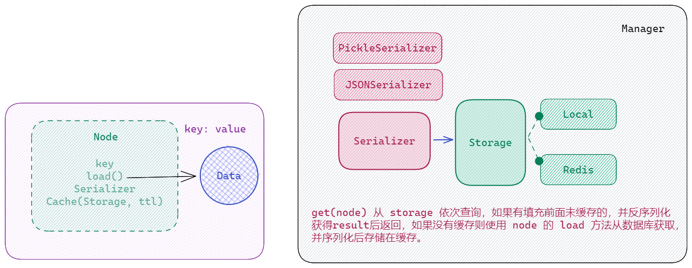

根据应用开发指南，实践到具体项目中。

Flask + MySQL + Redis + Celery + Gunicorn + Nginx + PDM + Docker + Github Actions

<!-- - 需求分析
  -	功能分析
  -	技术栈
  -	数据模型
  -	API设计 -->
- 开发环境搭建
  - [开发工具 - WSL2 Python IDE](./development#开发工具-tools)
    - IDE 扩展和配置
  - [版本控制 - Git](./git#初始配置)
    - commit message: 满足 [Conventional Commits ](https://www.conventionalcommits.org/en/v1.0.0/) 规范（基于 [Angular Commit Guidelines](https://github.com/angular/angular/blob/22b96b9/CONTRIBUTING.md#-commit-message-guidelines)）
    - Semantic version: https://semver.org/
    - changelog: https://keepachangelog.com/en/1.1.0/
    - 用到的工具 [commitizen](https://github.com/commitizen-tools/commitizen) 或 [czg](https://cz-git.qbb.sh/zh/cli/)
    - .gitignore
  - [容器环境 - Docker](./docker#安装-docker-和-docker-compose)
    - Dockerfile
    - compose.yaml
    - .dockerignore
  - [依赖管理 - PDM](./development.md#开发依赖-dependency)
- 开发流程
  - 版本控制（git）
    ```sh
    git init
    git add .
    git commit -m "msg"
    git remote add origin <url>
    ```
  - 依赖管理
    ```sh
    pdm init -n
    pdm add flask
    pdm add -d ruff black
    ```
  - 文档管理（document）
  - 质量管理（workflow）
- 业务开发
  - 基础知识
  - 统一环境变量
  - 模块化（分层组织、协议约束）
  - 数据流向（数据驱动，根据数据的流动来构思框架）
- 持续优化
  - 并行、
  - 异步、
  - 调度、
  - 池化、
  - 分层、
  - 缓存。


## Install Backing Services

使用 docker compose 搭建本地开发后端服务支持。

- MySQL
- Redis
- Celery
- Nginx
- Meilisearch

## 开发规范

### Project Structure

对于应用程序使用 flat layout 更合适，如果作为包发布可能 src layout 更好。[about](https://packaging.python.org/en/latest/discussions/src-layout-vs-flat-layout/)

::: code-group
```sh [Project Structure]
project_root/
┣ .venv/                        # virtual environment
┣ .vscode/                      # vscode settings
┃ ┣ extensions.json
┃ ┗ settings.json
┣ app/                          # application code
┃ ┣ __init__.py
┃ ┗ app.py
┣ compose/                      # docker compose files
┃ ┣ mysql/
┃ ┃ ┗ my.cnf
┃ ┣ nginx/
┃ ┃ ┣ Dockerfile
┃ ┃ ┗ nginx.conf
┃ ┣ redis/
┃ ┃ ┣ Dockerfile
┃ ┃ ┗ redis.conf
┃ ┗ web/
┃ ┃ ┣ celery/
┃ ┃ ┃ ┣ beat/
┃ ┃ ┃ ┃ ┗ start.sh
┃ ┃ ┃ ┣ flower/
┃ ┃ ┃ ┃ ┗ start.sh
┃ ┃ ┃ ┗ worker/
┃ ┃ ┃ ┃ ┗ start.sh
┃ ┃ ┣ Dockerfile
┃ ┃ ┗ entrypoint.sh
┣ docs/
┣ .env                       # environment variables
┣ CHANGELOG.md
┣ CONTRIBUTING.md
┣ LICENSE
┣ README.md
┣ compose.yaml               # docker compose entry point
┣ pdm.lock
┗ pyproject.toml                # dependency management

┣ app/
┃ ┣ core/                       # base app logic
┃ ┃ ┣ config.py
┃ ┃ ┣ exceptions.py
┃ ┃ ┣ log_config.py
┃ ┃ ┗ __init__.py
┃ ┣ util/                       # app specific tasks
┃ ┃ ┣ do_thing.py
┃ ┃ ┣ do_other_thing.py
┃ ┃ ┗ __init__.py
┃ ┣ main.py                     # entry point to application
┃ ┗ __init__.py
┣ tests/                        # tests live outside application

```
:::

### Code Style

规范：
- [PEP 8 – Style Guide for Python Code](https://peps.python.org/pep-0008/)
  - .editorconfig
  - naming
    - 单数、小写（常量大写）
    - 连字符：`-` or `_`
    - 尽可能全称
- [Google Docstrings Style](https://github.com/google/styleguide/blob/gh-pages/pyguide.md#38-comments-and-docstrings)
- [Optional Spelling](https://github.com/codespell-project/codespell)

工具
- [black](https://github.com/psf/black) formatter
- [ruff](https://github.com/charliermarsh/ruff) linter
- [VS Code plugis - autoDocstring](https://marketplace.visualstudio.com/items?itemName=njpwerner.autodocstring) docstrings

### Static Type Checking

规范：
- [PEP 484 – Type Hints](https://peps.python.org/pep-0484/) 在 PEP3107 基础上规范 type hint 标准语义。2014.9.29
  - [PEP 593 – Flexible function and variable annotations](https://peps.python.org/pep-0593/) 使用一个特定于上下文的元数据包装现有类型，Annotated[T, x] T作为静态类型检查，x作为运行时实际值。2019.4.26 3.9
  - [PEP 613 – Explicit Type Aliases](https://peps.python.org/pep-0613/) 显示类型别名 2020.1.21 3.10

工具：
- [mypy](https://github.com/python/mypy) static type checker for Python
- [pyright/pylance]() another static type checker for Python，与 vscode 集成(pylance)。

Type Hints 将动态的Python语言有了静态类型检查的能力，这对于在编码阶段发现bug，提高代码可读性，IDE自动补全等都有很大的帮助。但是，Type Hints并不会影响运行时的行为，也就是说，Type Hints只是一种静态检查，而不是强制性的类型约束。不过，pydantic这个库可以将Type Hints转换成强制性的类型约束，这样就可以在运行时强制检查类型了。

[More](./type_hints.md)

## API 规范

### RESTful API

遵循 RESTful API，考虑以下内容：

- 版本：`/api/v1/`
- 资源：URI表示某一资源
- 动作：HTTP方法表示对资源的操作
- 数据：JSON格式数据(请求和响应)
- 状态码：HTTP状态码表示请求结果
- 认证：OAuth 2使用了[承载令牌(Bearer tokens](http://tools.ietf.org/html/rfc6750)) 并且依赖于SSL的底层传输加密。
- 缓存：[ETag](http://en.wikipedia.org/wiki/HTTP_ETag)和[Last-Modified](http://www.w3.org/Protocols/rfc2616/rfc2616-sec14.html#sec14.29)
- 错误

[More](./restful_api.md)

### 异常处理

错误处理：定义常见错误码和错误信息，使得应用在出现错误时能够快速响应并给出明确的错误提示信息。

- Flask 内部错误（HTTPException），通过 errorhandler形式转换成dict，从而可以 json 化。
- 手动触发 自定义错误（APIException），类似手段，自动化处理成 JSON 格式。
- 调用第三方产生错误。TODO

::: code-group
```python [全局 json 处理]
# 1. 拦截函数处理 make_response，在真正处理 rv之前将返回的data转换成 JSON Response。
# 2. 替换app.json.proverder.dumps ，处理那些不支持的数据类型，比如 pydantic 的 BaseModel。也可以直接将内置json替换成为 orjson。
# 3. 处理其它，在json中没有处理的类型，比如Exception，因为 Flask 提供了错误处理装饰器，所以还是按照其逻辑处理
# 3.1 app.errorhandler(HTTPException) 使其data返回 dict 类型
# 3.2 自定义错误，app.errorhandler(APIException)，也将 data 返回 dict 类型
class OrJSONProvider(JSONProvider):
    def dumps(self, obj: t.Any, **kwargs: t.Any) -> str:
        try:
            res = orjson.dumps(obj)
        except Exception:
            # deal with other type
            if isinstance(obj, ToDictLike):
                res = orjson.dumps(obj.dict())
            if isinstance(obj, ToAsDictLike):
                res = orjson.dumps(obj.as_dict())
            raise
        return res.decode()

    def loads(self, s: str | bytes, **kwargs: t.Any) -> t.Any:
        return orjson.loads(s)

class APIFlask(Flask):
    json_provider_class = OrJSONProvider

    def make_response(self, rv: ResponseReturnValue) -> Response:
        """change to json Response"""
        if isinstance(rv, tuple):
            data, *other = rv
            rv = self.json.response(data), *other  # type: ignore
        elif not isinstance(rv, Response):
            rv = self.json.response(rv)

        return super().make_response(rv)
```

```python [异常处理]
# 自定义异常
class APIException(Exception):
    code: int = 500
    error_code: int = 10000
    message: str = "内部错误"

    def __init__(self, code: int | None = None, error_code: int | None = None, message: str | None = None) -> None:
        if code is not None:
            self.code = code
        if error_code is not None:
            self.error_code = error_code
        if message is not None:
            self.message = message
        super().__init__()

    def dict(self) -> dict[str, t.Any]:
        return {
            "code": self.code,
            "error_code": self.error_code,
            "message": self.message,
        }
# 之后将其注册到errorhandler，通过 error.dict()将data转换成dict即可。
```
:::

::: details
Flask 2.2+ 在内部实现了返回 dict 和 list 时的自动 json 化，但对于更多类型没有支持，需要黑魔法支持一下——在解析返回值（app.make_response）之前，全部将返回数据变成 dict 或者 list。
- str、int、byte -> dict
- HTTPException -> dict
- Pydantic BaseModel -> dict
:::

### 参数校验

[more](./schema.md)

## 统一日志

- 日志来源：Flask、werkzeug、Gunicorn等。需要将这些都统一取消后使用自定义的日志。
- 日志形式：自定义两种日志：access_log(请求记录)、error_log(错误收集、主动触发)。
- 日志级别：INFO、WARNING、ERROR。
- 日志格式：时间、请求信息、错误信息、堆栈信息等。
- 日志输出：控制台（开发）、文件（生产）。

[more](./log.md)

## 缓存设计

- 缓存对象：对象缓存、函数缓存
- 缓存策略：缓存时间、缓存大小
- 缓存位置：本地缓存、redis缓存
- 缓存安全：缓存击穿、缓存穿透

核心概念：

- Model：定义缓存对象（value）
- Node：定义缓存`大 key`，相对于普通的字符串 key，Node 除了`key()`来确定字符串key外，还包括了指定缓存位置和缓存时间，并负责从后端数据库获取 Model
  - storages：指定存储后端: ["local", {"storage": "redis", "ttl": timedelta(seconds=120)}]，按顺序获取，后端必须注册到 Manager 中
  - key()：定义key
  - load()：缓存不存在时加载函数
- Storage：缓存后端，负责存储和获取缓存对象
- Manager：缓存管理器，负责操作 Node
  - register_storage(name, Storage) 注册后端存储
  - all_storage：{"key": Storage} 所有已注册的后端存储
  - serializer: JSONSerializer 指定序列化方式，目前只有 JSONSerializer
  - get(node)：通过 node 获取缓存对象
  - remove(node, storage_name)：从指定后端删除缓存

Manager 的 get 方法通过同步锁避免缓存击穿，即当缓存不存在时，只有一个线程会去加载数据，其它线程会等待，直到缓存加载完成。



TODO list：
- [ ] 缓存穿透 使用布隆过滤器
- [ ] 错误处理，参数校验

## 后台任务

## 搜索服务

## 短信服务

## 通知服务

## 静态资源


## Github Ations

## References

- https://www.pythonbynight.com/blog/starting-python-project 项目布局
- https://py-pkgs.org/04-package-structure src 布局
- https://realpython.com/docker-continuous-integration/#dockerize-your-flask-web-application Docker 环境
