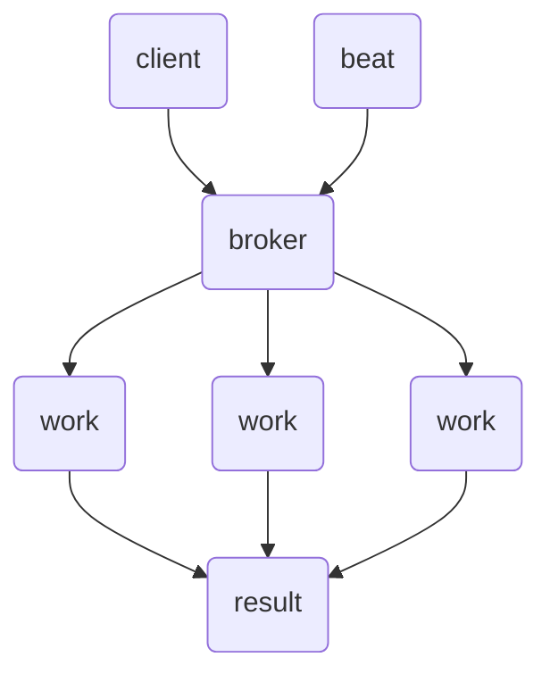

Celery 分布式异步任务队列。可管理 web 应用的后台耗时任务

- 调用其它服务：邮件、短信
- 后台耗时处理：图像处理、模型训练
- 周期任务：日志归档、统计日报、数据同步

可以使用应用性能监控工具 [New Relic](https://newrelic.com/) 检测耗时任务（尽量在 500 ms 以下）。

## 有什么

基于生产者/消费者模型，利用 redis 等实现队列功能。

client or `beat` --> `broker` --> queue --> `worker` --> `backend` --> flower 任务监控。

worker 会从 broker 中预取任务到 unacked （内存中的集合、包括过期时间），visibility_timeout参数指定了扫描 unacked "队列"的时间间隔，超时其它worker会使用这些 unacked 中的任务（重复执行任务）。如果时间设置太长，那么这个 worker 被杀死后，需要很长时间才能重新被执行。

- client：启动app，注册任务（task），调用任务（task id）。

- server：Manager
  - `broker`进行消息（`task`）接收处理以及调用相关 `worker` 进行实际处理。

- beat：定时任务（task），也相当于client。



### 配置项

- 全局
  - `timezone = "Asia/Shanghai"` 默认 UTC
  - `enable_utc = True` 启用 UTC
  - `worker_send_task_events = True` `-E` 参数，任务状态监控，flower，默认False
- task
  - `task_serializer = "json"` 将任务 json 化传递给 worker，任务包含了被celery装饰的函数参数，所以**参数一定要可序列化**
  - `task_soft_time_limit = 1800` 任务运行软限制，超时会（单位：秒）引发 SoftTimeLimitExceeded，默认无限制，还可以通过`@task(time_limit=30, soft_time_limit=10)` 在装饰函数时指定
  - `task_time_limit = task_soft_time_limit + 30` 任务运行最长时间（单位：秒，硬限制），超过后Celery 会向任务发送一个 SIGTERM 信号，试图终止任务的执行，如果没有响应信号，就发送 SIGKILL 信号。 默认无限制
  - `task_acks_late = True` 延迟确认，任务在执行完成后(已存储或处理结果)再进行确认（默认行为是在任务发送后立即确认），这样可以避免在worker 被杀死后任务不能重新执行的问题。但如果任务不是原子性的，那么对于执行了一部分的任务来说需要记住执行位置，所以尽可能让任务符合原子性
  - `task_reject_on_worker_lost = True` 如果worker意外退出，则任务重新放回队列
  - queue and router：queue是任务队列，router是将任务与指定队列进行绑定
    - `task_default_queue = "default"` 指定默认队列的名称，默认是"celery"
    - `task_create_missing_queues = False` task_queues 没有指定的队列将不会创建
    - `task_queues = (Queue("default"))` 指定可以使用的队列，上面的False后，必须也将 default 明确列出
    - `task_routes = ()` 指定任务与队列的绑定关系
  - 在使用`@task(name="email:send")`时，明确指定每个任务的 name
  - 耗时任务分解为小任务，从而利用多个 worker，而不是使用一个worker完成耗时任务
  - 事务数据要在 task 内获取，不能作为参数传入
  - `task_always_eager=True` 将异步执行变成同步，方便开发调试，但任务返回`EagerResult`
- broker
  - `broker="redis://:123456@localhost:6379/0"` 设置消息队列后端
  - `broker_transport_options = {"visibility_timeout": 900}` 任务分配给 worker 的时间，如果超时没有确认，则重新分配
  - `broker_pool_limit = 0` gevent 时设置 broker_pool 为 None ,禁止为每个 worker 创建连接，避免连接错误
- worker
  - `accept_content = ["json"]`  worker 可接受的内容类型
  - `worker_prefetch_multiplier = 1` 每个 worker 预取的任务数，默认4，一般为了避免 worker 被杀死后任务不能被其它 worker 执行的问题，设置为1
  - `worker_concurrency = 1` 并发数，默认CPU核心数，`-c` 命令参数
  - `worker_max_tasks_per_child = 500` worker 执行最大任务数，之后替换为新的进程
  - `worker_max_memory_per_child = 5000` 内存使用超过内存量（KB）后，替换为新的 worker，缓解内存泄漏
- result
  - `result_serializer = "json"` 结果序列化后存储
  - `result_backend = "redis://:123456@localhost:6379/1"` 结果存储后端
  - `result_expires = timedelta(days=3)` 结果存储过期时间， 默认 24 小时
- beat
  - `beat_schedule` 定时任务

### Message Broker

消息代理用于传输生产或消费的任务。[AMQP](https://en.wikipedia.org/wiki/Advanced_Message_Queuing_Protocol) (Advanced Message Queuing Protocol)

- Redis
- RabbitMAQ

Multiple Queues and Task Routing

```python
# 指定默认队列名称
task_default_queue = "default"
# task_queues 没有指定的队列将不会创建
task_create_missing_queues = False
task_queues = (
    Queue("default", routing_key="task.#"),
    Queue("email", routing_key="email.#"),
    Queue("sms", routing_key="sms.#"),
    Queue("high_priority"),
    Queue("low_priority"),
)

# CELERY_TASK_ROUTES = {
#     "project.users.tasks.*": {
#         "queue": "high_priority",
#     },
# }

celery -A task.app worker --loglevel=info -Q default,email,sms,low_priority,hight_priority

add.apply_async(args=[1, 2], queue='high_priority')
```

### Retry

设置任务重试

```python
@shared_task(bind=True, autoretry_for=(Exception,), retry_backoff=True, retry_jitter=True, retry_kwargs={'max_retries': 5})
def task_process_notification(self):
    if not random.choice([0, 1]):
        # mimic random error
        raise Exception()

    requests.post('https://httpbin.org/delay/5')

# 或者使用基类重用参数
class BaseTaskWithRetry(celery.Task):
    autoretry_for = (Exception, KeyError)
    retry_kwargs = {'max_retries': 5}
    retry_backoff = True

    # 任务失败时执行
    def on_failure(self, exc, task_id, args, kwargs, einfo):
        # exc 错误类型
        # task_id 任务id
        print('{0!r} failed: {1!r}'.format(task_id, exc))

    # 任务成功时执行
    def on_success(self, retval, task_id, args, kwargs):
        pass

    # 任务重试时执行
    def on_retry(self, exc, task_id, args, kwargs, einfo):
        pass


@shared_task(bind=True, base=BaseTaskWithRetry)
def task_process_notification(self):
    if not random.choice([0, 1]):
        # mimic random error
        raise Exception()

    requests.post('https://httpbin.org/delay/5')
```

- `autoretry_for` 监听需要重试的错误
- `retry_backoff=True` 指数退避，重试间隔呈指数增长，`retry_backoff=5` 设置延迟因子
- `retry_jitter=True` 随机抖动，防止 thundering herd，默认就是`True`
- `retry_kwargs` dict 类型
  - `max_retries` 最大重试次数
  - `countdown` 延迟5秒后重试，设置 `retry_backoff=True` 后不用设置

### log

```python
import logging
from celery.signals import setup_logging


@setup_logging.connect()
def on_setup_logging(**kwargs):
    # 设置日志
```

## 使用

### 注册任务

- 在装饰任务函数时明确指明名称和 `@shared_task(name="email:send")`
  - 队列是在 配置项 `task_queues` 和命令 `celery -A task.app worker --loglevel=info -Q default,email,sms,low_priority,hight_priority` 指定
- 在定义了celery app（task/app.py）里面要把定义了的任务函数注册到celery app里面，否则celery app不知道有哪些任务函数
  - `from task.tasks import *`

```python
from celery import shared_task

# 强制使用 name
@shared_task(bind=True, name="add")  # 默认是default 队列
def add(self: "Task[[int, int], int]", x: int, y: int) -> int:
    import time

    self.update_state(state="PROGRESS", meta={"progress": 0})
    time.sleep(x)
    return x + y

```

### 启动

```sh
# 启动 worker
celery -A task.app worker -l INFO -P gevent -c 4 -E -Q primary_queue
# 启动 beat
celery -A task.app beat -l INFO
# 启动 flower
celery -A task.app flower --port=5555
```

- `-P gevent` `--pool` 指定 worker 创建的形式，还可以设置`celery.conf.worker_pool = 'prefork'`默认是`prefork`使用进程。但 gevent 等必须只能 `-P` 命令，不能使用 `worker_pool` 配置项 [here](https://docs.celeryq.dev/en/stable/userguide/configuration.html#worker-pool)
- `-c 4` `--concurrency`4个 worker
- `-E` 启用事件通知
- `-Q <name>` 指定 worker 的消息队列

```python
from celery import Celery

app = Celery(__name__, broker="redis://localhost:3306/0", backend="redis://localhost:3306/0")

app.conf.config_from_object(config)


@app.task(name="task_1", bind=True)
def task_1(self):
    return "ok"

result = task_1.delay()
# or
task_1.apply_async()
# args=(,)
# countdown=10 10秒后运行，
# eta 更精确的时间控制 datetime.now() + timedelta()
# 延迟时间不应超过 visibility_timeout
```

### 调用

```python
r = task.delay(*args, **kwargs)  # apply_async(*args, **kwargs) 简化
# or
r = task.apply_async(args=(a,))

r.ready()             # 任务是否执行完成 True or False
r.get(timeout=1)      # 获取任务执行结果，可以设置等待时间
r.result              # 任务执行结果
r.status              # 任务当前的状态 PENDING START or SUCCESS
r.traceback           # 获取原始的错误回溯信息
```

### 结果通知

TODO 使用 websockets 实时显示状态结果。

## 问题

-  **Celery delayed tasks don’t scale.**[Building a Distributed Task Queue in Python](https://wakatime.com/blog/56-building-a-distributed-task-queue-in-python)
-  长任务中断
   -  分解为小任务
   -  任务分批

-  主动取消任务：`base=celery.contrib.abortable.AbortableTask` self.is_aborted() 判断是否取消，`task.abort()`取消。
-  worker 被杀死后任务丢失
   -  `celery_app.conf.task_acks_late = True` 延迟确认，任务完成后再消耗任务，这样worker被杀死后还能继续使用其它worker执行任务。
   -  `celery_app.conf.broker_transport_options = {"visibility_timeout": datetime.timedelta(minutes=15)}` worker 被杀死后尽快让任务可以被其它worker发现，默认是1h。
   -  `celery_app.conf.task_reject_on_worker_lost = True` 当 worker 被杀后，关闭当前未完成的任务(未完成)
   -  `celery_app.conf.worker_prefetch_multiplier = 1` 每个 worker 默认预取4个任务，这样当第一个任务失败后需要visibility_timeout 之后才能将任务分配给其它任务，所以可以将其设置为1

-  [celery僵死导致jumpserver提示 连接WebSocket失败 - 亚里士多智 - 博客园 (cnblogs.com)](https://www.cnblogs.com/wiseo/p/jms.html)

-  `eta` 和 `countdown` 设置要小于 `visibility_timeout` ，因为任务是已经分配给了 worker，存在于内存中（同样会造成内存泄漏），如果超过，则会重新分配worker。尽可能**避免使用**这两个参数，使用 beat 替代。 [issue](https://github.com/celery/celery/issues/8069)

-  无优先级，只有优先队列，但是没有优先任务的概念。

## 其它库

- [WakaQ](https://github.com/wakatime/wakaq) 轻量，只支持 redis
- [huey](https://github.com/coleifer/huey) 轻量，只支持 redis
- [taskiq-python/taskiq: Distributed task queue with full async support (github.com)](https://github.com/taskiq-python/taskiq) 支持异步、type hint。

## References

- [Monitoring Celery | An Actionable Guide](https://cronitor.io/guides/monitoring-celery)
- [Python Celery 分布式任务](https://blog.csdn.net/wanglei_storage/article/details/130029916)
- [Celery on AWS](https://github.com/jangia/celery_ecs_example)
- [Background Tasks with Celery — Flask](https://flask.palletsprojects.com/en/2.3.x/patterns/celery/)
- [Celery ETA Tasks Demystified](https://engineering.instawork.com/celery-eta-tasks-demystified-424b836e4e94)
- [DevChecklists | Celery tasks checklist --- 开发清单](https://web.archive.org/web/20221126095422/https://devchecklists.com/celery-tasks-checklist/)
- [The Definitive Guide to Celery and Flask](https://testdriven.io/courses/flask-celery/)

